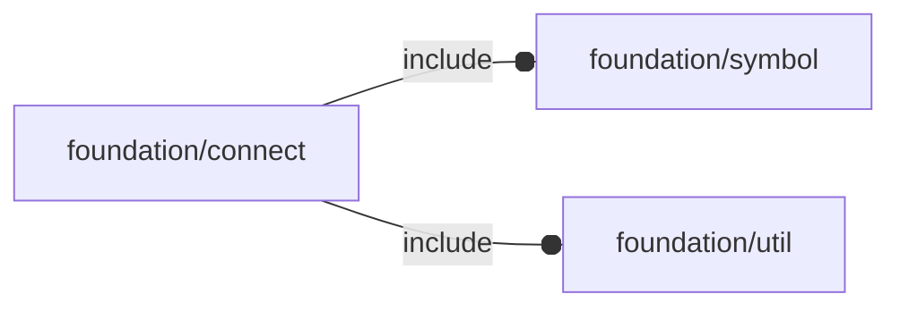

# package foundation/connect

## Dependencies



utility toolkit for connecting objects

Copyright © 2021, Giampiero Gabbiani (giampiero@gabbiani.org)

SPDX-License-Identifier: [GPL-3.0-or-later](https://spdx.org/licenses/GPL-3.0-or-later.html)


## Functions

---

### function conn_Plug

__Syntax:__

```text
conn_Plug(id,ox,oy,pos,size=2.54,octant,direction=[+Z,0])
```

---

### function conn_Socket

__Syntax:__

```text
conn_Socket(id,ox,oy,pos,size=2.54,octant,direction=[+Z,0])
```

---

### function fl_conn_clone

__Syntax:__

```text
fl_conn_clone(original,type,id,ox,oy,pos,size,octant,direction,M=I)
```

returns a copy of the given connection with eventual rewriting of attributes

__Parameters:__

__original__  
MANDATORY original connection to be cloned

__type__  
OPTIONAL new connection type ("socket" or "plug")

__id__  
OPTIONAL new connection id

__ox__  
OPTIONAL new orientation X

__oy__  
OPTIONAL new orientation Y

__pos__  
OPTIONAL new position

__size__  
OPTIONAL new size

__octant__  
OPTIONAL label octant

__direction__  
OPTIONAL label [direction,rotation]

__M__  
OPTIONAL transformation matrix for position transformation


---

### function fl_conn_id

__Syntax:__

```text
fl_conn_id(type,value)
```

---

### function fl_conn_import

__Syntax:__

```text
fl_conn_import(conns,M)
```

massive connection clone eventually transformed

---

### function fl_conn_ldir

__Syntax:__

```text
fl_conn_ldir(type,value)
```

---

### function fl_conn_loct

__Syntax:__

```text
fl_conn_loct(type,value)
```

---

### function fl_conn_ox

__Syntax:__

```text
fl_conn_ox(type,value)
```

---

### function fl_conn_oy

__Syntax:__

```text
fl_conn_oy(type,value)
```

---

### function fl_conn_pos

__Syntax:__

```text
fl_conn_pos(type,value)
```

---

### function fl_conn_size

__Syntax:__

```text
fl_conn_size(type,value)
```

---

### function fl_conn_type

__Syntax:__

```text
fl_conn_type(type,value)
```

---

### function fl_connect

__Syntax:__

```text
fl_connect(son,parent)
```

Returns the transformation matrix moving child shape to its parent
coherently with their respective connection geometries.
Child can be thought as a mobile socket/plug jointing a fixed plug/socket
(the parent).

The transformations applied to children are:

1. move children connector to origin
2. align children axes to parent connector axes
3. move children connector to parent connector position

TODO: symbol orientation is managed by passing x and y plane while
calculating z consequently. It should be managed through the couple
[director,rotor] instead.


__Parameters:__

__son__  
child to be moved, either a connector or a list [child object,connector number]

__parent__  
fixed parent, either a connector or a list [parent object,connector number]


## Modules

---

### module fl_conn_Context

__Syntax:__

    fl_conn_Context(connector,ordinal)

Prepares context for children() connectors

- $conn_i    : OPTIONAL connection number
- $conn_ox   : X axis
- $conn_oy   : Y axis
- $conn_label: OPTIONAL string label
- $conn_ldir : [direction,rotation]
- $conn_loct : label octant
- $conn_pos  : position
- $conn_size : OPTIONAL connector size
- $conn_type : connector type


__Parameters:__

__ordinal__  
OPTIONAL connection number


---

### module fl_conn_add

__Syntax:__

    fl_conn_add(connector,size,label)

Adds proper connection symbol (plug or socket) to the scene

---

### module fl_conn_debug

__Syntax:__

    fl_conn_debug(conns,debug)

Layouts connector symbols.


__Parameters:__

__conns__  
list of connectors

__debug__  
see constructor [fl_parm_Debug()](base_parameters.md#function-fl_parm_debug)


---

### module fl_connect

__Syntax:__

    fl_connect(son,parent)

See function [fl_connect()](#function-fl_connect) for docs.

Children context:

- $con_child : OPTIONAL child object (undef when direct connector is passed)
- $con_parent: OPTIONAL parent object (undef when direct connector is passed)


__Parameters:__

__son__  
child to be moved, can be either a connector or a list [object,connector number]

__parent__  
fixed parent, can be either a connector or a list [object,connector number]


---

### module fl_lay_connectors

__Syntax:__

    fl_lay_connectors(conns)

Layouts children along a list of connectors.

See [fl_conn_Context{}](#module-fl_conn_context) for context variables passed to children().


__Parameters:__

__conns__  
list of connectors


