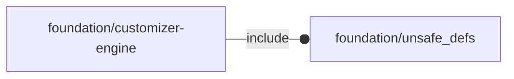

# package foundation/customizer-engine

## Dependencies



OpenSCAD customizer helpers.

This file is part of the 'OpenSCAD Foundation Library' (OFL) project.

Copyright © 2021, Giampiero Gabbiani <giampiero@gabbiani.org>

SPDX-License-Identifier: [GPL-3.0-or-later](https://spdx.org/licenses/GPL-3.0-or-later.html)


## Variables

---

### variable FL_CUST_NS

__Default:__

    "cust"

prefix used for namespacing

## Functions

---

### function fl_cust_undef

__Syntax:__

```text
fl_cust_undef(value,_if_="undef",_when_=false)
```

Returns a value based on conditional logic, typically used for handling
undefined or default values in customizer settings.


__Parameters:__

__value__  
value to be checked

___if___  
value to be checked for returning «undef»

___when___  
condition to be checked for returning «undef»


