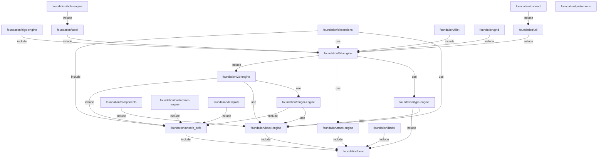

# Dependencies

```mermaid
graph TD
    A1[foundation/2d-engine] --o|include| A2[foundation/unsafe_defs]
    A1 --o|use| A3[foundation/bbox-engine]
    A1 --o|use| A4[foundation/mngm-engine]
    A5[foundation/3d-engine] --o|include| A1
    A5 --o|use| A6[foundation/traits-engine]
    A5 --o|use| A7[foundation/type-engine]
    A8[foundation/algo-engine] --o|include| A5
    A3 --o|include| A9[foundation/core]
    A10[foundation/components] --o|include| A3
    A11[foundation/connect] --o|include| A12[foundation/util]
    A9
    A13[foundation/customizer-engine] --o|include| A2
    A14[foundation/dimensions] --o|include| A2
    A14 --o|use| A5
    A14 --o|use| A3
    A15[foundation/fillet] --o|include| A5
    A16[foundation/grid] --o|include| A5
    A17[foundation/hole-engine] --o|include| A18[foundation/label]
    A18 --o|include| A5
    A19[foundation/limits] --o|include| A9
    A4 --o|include| A2
    A4 --o|use| A3
    A20[foundation/quaternions]
    A21[foundation/template] --o|include| A2
    A6 --o|include| A9
    A7 --o|include| A9
    A7 --o|use| A3
    A2 --o|include| A9
    A12 --o|include| A5
```

