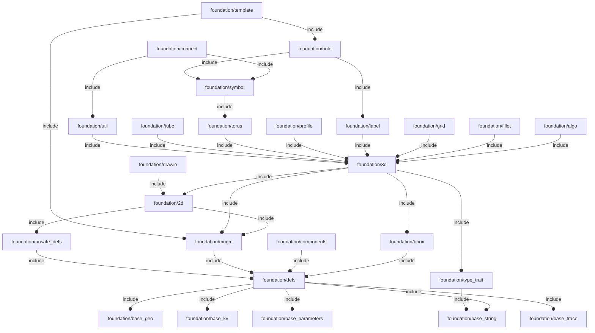

# Dependencies

```mermaid
graph TD
    A1[foundation/2d] --o|include| A2[foundation/mngm]
    A1 --o|include| A3[foundation/unsafe_defs]
    A4[foundation/3d] --o|include| A1
    A4 --o|include| A5[foundation/bbox]
    A4 --o|include| A2
    A4 --o|include| A6[foundation/type_trait]
    A7[foundation/algo] --o|include| A4
    A8[foundation/base_geo]
    A9[foundation/base_kv]
    A10[foundation/base_parameters]
    A11[foundation/base_string]
    A12[foundation/base_trace]
    A5 --o|include| A13[foundation/defs]
    A14[foundation/components] --o|include| A13
    A15[foundation/connect] --o|include| A16[foundation/symbol]
    A15 --o|include| A17[foundation/util]
    A13 --o|include| A8
    A13 --o|include| A9
    A13 --o|include| A10
    A13 --o|include| A11
    A13 --o|include| A12
    A18[foundation/drawio] --o|include| A1
    A19[foundation/fillet] --o|include| A4
    A20[foundation/grid] --o|include| A4
    A21[foundation/hole] --o|include| A22[foundation/label]
    A21 --o|include| A16
    A22 --o|include| A4
    A2 --o|include| A13
    A23[foundation/profile] --o|include| A4
    A16 --o|include| A24[foundation/torus]
    A25[foundation/template] --o|include| A21
    A25 --o|include| A2
    A24 --o|include| A4
    A26[foundation/tube] --o|include| A4
    A6 --o|include| A11
    A3 --o|include| A13
    A17 --o|include| A4
```

