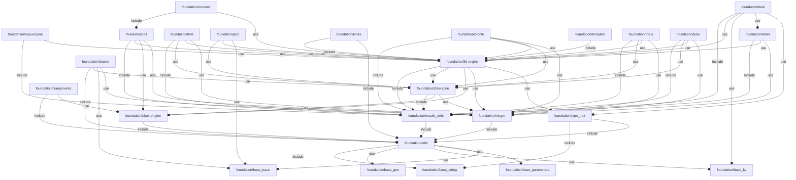

# Dependencies

```mermaid
graph TD
    A1[foundation/2d-engine] --o|include| A2[foundation/unsafe_defs]
    A1 --o|use| A3[foundation/bbox-engine]
    A1 --o|use| A4[foundation/mngm]
    A5[foundation/3d-engine] --o|include| A2
    A5 --o|use| A1
    A5 --o|use| A3
    A5 --o|use| A4
    A5 --o|use| A6[foundation/type_trait]
    A7[foundation/algo-engine] --o|include| A2
    A7 --o|use| A5
    A8[foundation/base_geo]
    A9[foundation/base_kv]
    A10[foundation/base_parameters]
    A11[foundation/base_string]
    A12[foundation/base_trace]
    A3 --o|include| A13[foundation/defs]
    A14[foundation/components] --o|include| A13
    A14 --o|use| A3
    A15[foundation/connect] --o|include| A16[foundation/util]
    A15 --o|use| A5
    A13 --o|include| A11
    A13 --o|use| A8
    A13 --o|use| A9
    A13 --o|use| A10
    A13 --o|use| A12
    A17[foundation/drawio] --o|include| A13
    A17 --o|use| A1
    A17 --o|use| A12
    A17 --o|use| A4
    A18[foundation/fillet] --o|include| A2
    A18 --o|use| A1
    A18 --o|use| A5
    A18 --o|use| A4
    A19[foundation/grid] --o|use| A1
    A19 --o|use| A5
    A19 --o|use| A12
    A20[foundation/hole] --o|include| A2
    A20 --o|use| A5
    A20 --o|use| A9
    A20 --o|use| A21[foundation/label]
    A20 --o|use| A6
    A21 --o|include| A2
    A21 --o|use| A5
    A21 --o|use| A4
    A22[foundation/limits] --o|include| A5
    A22 --o|include| A13
    A4 --o|include| A13
    A23[foundation/profile] --o|include| A2
    A23 --o|use| A1
    A23 --o|use| A5
    A23 --o|use| A4
    A24[foundation/template] --o|include| A5
    A25[foundation/torus] --o|include| A2
    A25 --o|use| A1
    A25 --o|use| A5
    A25 --o|use| A4
    A26[foundation/tube] --o|include| A2
    A26 --o|use| A1
    A26 --o|use| A5
    A26 --o|use| A4
    A6 --o|include| A11
    A6 --o|include| A13
    A2 --o|include| A13
    A16 --o|include| A2
    A16 --o|use| A5
    A16 --o|use| A3
    A16 --o|use| A4
```

