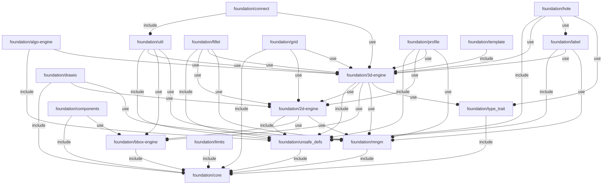

# Dependencies

```mermaid
graph TD
    A1[foundation/2d-engine] --o|include| A2[foundation/unsafe_defs]
    A1 --o|use| A3[foundation/bbox-engine]
    A1 --o|use| A4[foundation/mngm]
    A5[foundation/3d-engine] --o|include| A2
    A5 --o|use| A1
    A5 --o|use| A3
    A5 --o|use| A4
    A5 --o|use| A6[foundation/type_trait]
    A7[foundation/algo-engine] --o|include| A2
    A7 --o|use| A5
    A3 --o|include| A8[foundation/core]
    A9[foundation/components] --o|include| A8
    A9 --o|use| A3
    A10[foundation/connect] --o|include| A11[foundation/util]
    A10 --o|use| A5
    A8
    A12[foundation/drawio] --o|include| A8
    A12 --o|use| A1
    A12 --o|use| A4
    A13[foundation/fillet] --o|include| A2
    A13 --o|use| A1
    A13 --o|use| A5
    A13 --o|use| A4
    A14[foundation/grid] --o|include| A8
    A14 --o|use| A1
    A14 --o|use| A5
    A15[foundation/hole] --o|include| A2
    A15 --o|use| A5
    A15 --o|use| A16[foundation/label]
    A15 --o|use| A6
    A16 --o|include| A2
    A16 --o|use| A5
    A16 --o|use| A4
    A17[foundation/limits] --o|include| A8
    A4 --o|include| A8
    A18[foundation/profile] --o|include| A2
    A18 --o|use| A1
    A18 --o|use| A5
    A18 --o|use| A4
    A19[foundation/template] --o|include| A5
    A6 --o|include| A8
    A2 --o|include| A8
    A11 --o|include| A2
    A11 --o|use| A5
    A11 --o|use| A3
    A11 --o|use| A4
```

