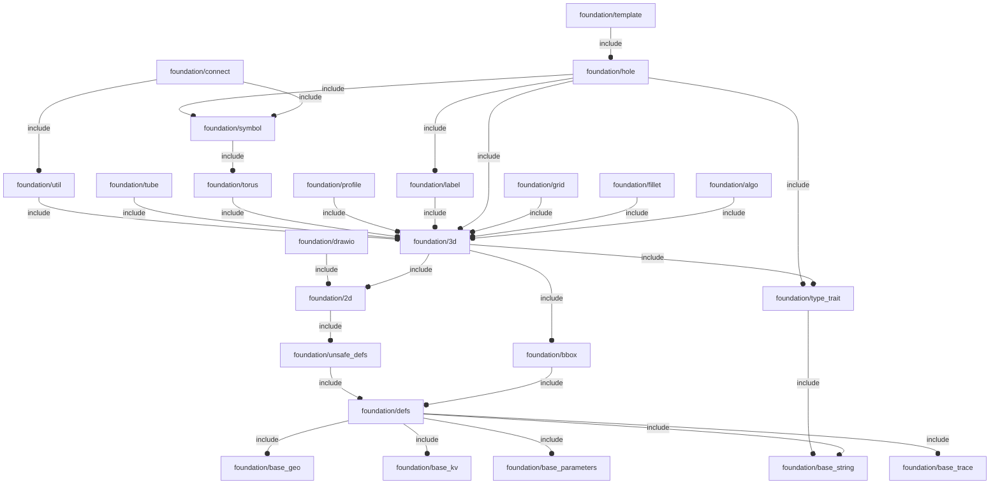

# Dependencies

```mermaid
graph TD
    A1[foundation/2d] --o|include| A2[foundation/unsafe_defs]
    A3[foundation/3d] --o|include| A1
    A3 --o|include| A4[foundation/bbox]
    A3 --o|include| A5[foundation/type_trait]
    A6[foundation/algo] --o|include| A3
    A7[foundation/base_geo]
    A8[foundation/base_kv]
    A9[foundation/base_parameters]
    A10[foundation/base_string]
    A11[foundation/base_trace]
    A4 --o|include| A12[foundation/defs]
    A13[foundation/connect] --o|include| A14[foundation/symbol]
    A13 --o|include| A15[foundation/util]
    A12 --o|include| A7
    A12 --o|include| A8
    A12 --o|include| A9
    A12 --o|include| A10
    A12 --o|include| A11
    A16[foundation/drawio] --o|include| A1
    A17[foundation/fillet] --o|include| A3
    A18[foundation/grid] --o|include| A3
    A19[foundation/hole] --o|include| A3
    A19 --o|include| A20[foundation/label]
    A19 --o|include| A14
    A19 --o|include| A5
    A20 --o|include| A3
    A21[foundation/profile] --o|include| A3
    A14 --o|include| A22[foundation/torus]
    A23[foundation/template] --o|include| A19
    A22 --o|include| A3
    A24[foundation/tube] --o|include| A3
    A5 --o|include| A10
    A2 --o|include| A12
    A15 --o|include| A3
```

