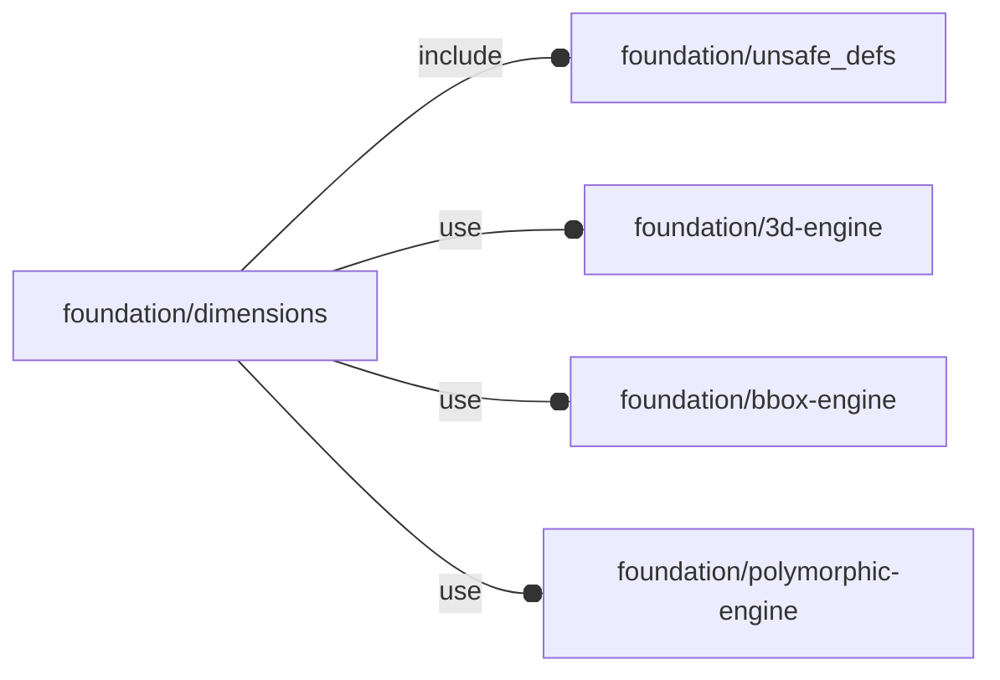

# package foundation/dimensions

## Dependencies



Dimension line library.

This file is part of the 'OpenSCAD Foundation Library' (OFL) project.

Copyright © 2021, Giampiero Gabbiani <giampiero@gabbiani.org>

SPDX-License-Identifier: [GPL-3.0-or-later](https://spdx.org/licenses/GPL-3.0-or-later.html)


## Variables

---

### variable $DIM_MODE

__Default:__

    "full"

---

### variable FL_DIM_INVENTORY

__Default:__

    []

package inventory as a list of pre-defined and ready-to-use 'objects'

---

### variable FL_DIM_NS

__Default:__

    "dims"

prefix used for namespacing

---

### variable cylinder

__Default:__

    fl_cylinder_defaults(h=h,d=d)

---

### variable d

__Default:__

    4

---

### variable dim_diameter

__Default:__

    fl_Dimension(value=d,label="diameter",object=cylinder,spread=-Y,align=O)

---

### variable dim_height

__Default:__

    fl_Dimension(value=h,label="height",object=cylinder,spread=+X,align=+Y)

---

### variable dim_radius

__Default:__

    fl_Dimension(value=d/2,label="radius",object=cylinder,spread=-Y,align=+X)

---

### variable h

__Default:__

    10

---

### variable line_w

__Default:__

    0.1

## Functions

---

### function fl_Dimension

__Syntax:__

```text
fl_Dimension(value,label,object,spread=+X,align=[0,0,0])
```

Constructor for dimension lines.

This geometry is meant to be used on a 'top view' projection, with Z axis as normal.


__Parameters:__

__value__  
mandatory value

__label__  
mandatory label string

__object__  
The object to which the dimension line is attached.

__spread__  
Spread direction in the orthogonal view of the dimension lines.


__align__  
By default the dimension line is centered on the «quadrant» parameter.


---

### function fl_dims_label

__Syntax:__

```text
fl_dims_label(type,value)
```

---

### function fl_dims_value

__Syntax:__

```text
fl_dims_value(type,value)
```

## Modules

---

### module fl_dimension

__Syntax:__

    fl_dimension(verbs=FL_ADD,geometry,line_width,gap=1,octant,direction,debug)

Children context:

- $dim_quadrant  : current spread
- $dim_width     : current line width
- $dim_gap       : initial gap from the object bounding-box and between
 subsequent lines in case of stacking
- $dim_align     : current alignment
- $dim_level     : current dimension line stacking level (always positive)
- $dim_normal    : «normal» parameter


__Parameters:__

__verbs__  
supported verbs: FL_ADD

__line_width__  
line width

__gap__  
lines gap

__octant__  
when undef native positioning is used

__direction__  
desired direction [director,rotation], native direction when undef ([+X+Y+Z])

__debug__  
see constructor [fl_parm_Debug()](core.md#function-fl_parm_debug)


