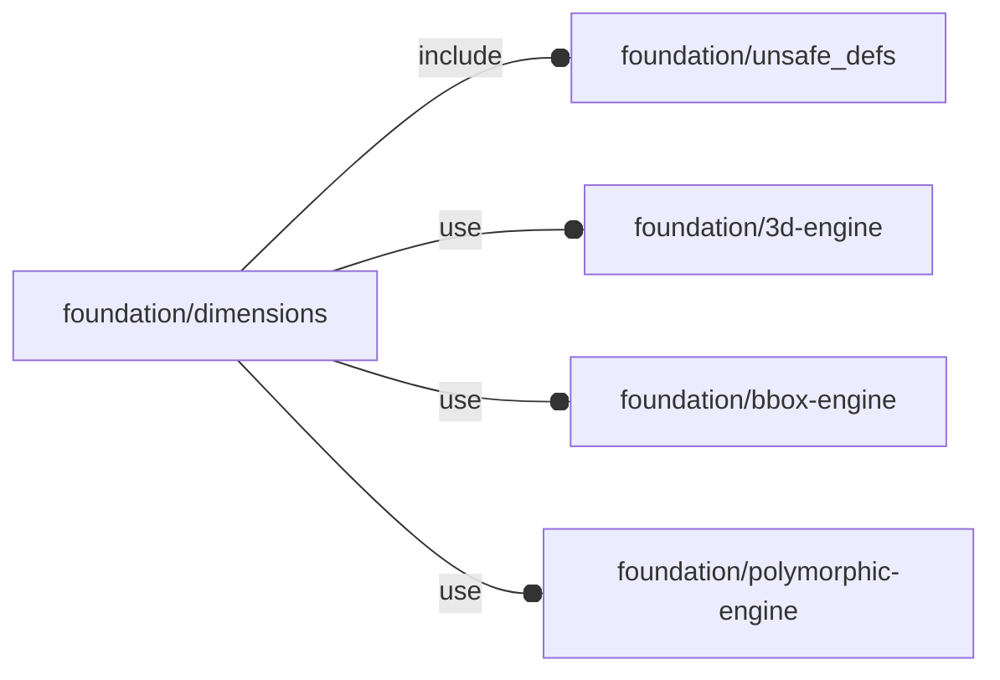

# package foundation/dimensions

## Dependencies



Dimension line library.

This file is part of the 'OpenSCAD Foundation Library' (OFL) project.

Copyright © 2021, Giampiero Gabbiani <giampiero@gabbiani.org>

SPDX-License-Identifier: [GPL-3.0-or-later](https://spdx.org/licenses/GPL-3.0-or-later.html)


## Variables

---

### variable $DIM_GAP

__Default:__

    1

gap between dimension lines

---

### variable FL_DIM_INVENTORY

__Default:__

    []

package inventory as a list of pre-defined and ready-to-use 'objects'

---

### variable FL_DIM_NS

__Default:__

    "dim"

prefix used for namespacing

## Functions

---

### function fl_Dimension

__Syntax:__

```text
fl_Dimension(value,label)
```

Constructor for dimension lines.

This geometry is meant to be used on a 'top view' projection, with Z axis as normal.


__Parameters:__

__value__  
mandatory value

__label__  
mandatory label string


---

### function fl_dim_label

__Syntax:__

```text
fl_dim_label(type,value)
```

---

### function fl_dim_value

__Syntax:__

```text
fl_dim_value(type,value)
```

## Modules

---

### module fl_dimension

__Syntax:__

    fl_dimension(verbs=FL_ADD,geometry,align,spread,gap,line_width,object,view,debug)

Children context:

- $dim_align   : current alignment
- $dim_label   : current dimension line label
- $dim_object  : bounded object
- $dim_spread  : spread vector
- $dim_value   : current value
- $dim_view    : dimension line bounded view
- $dim_width   : current line width
- $dim_level   : current dimension line stacking level (always positive)


__Parameters:__

__verbs__  
supported verbs: FL_ADD

__align__  
Position of the measure line with respect to its distribute direction:

- "centered": default value
- "positive": aligned in the positive half of the view plane
- "negative": aligned in the negative half of the view plane
- «scalar signed value»: position of the start of the measurement line on
  the normal to its distribution vector


__spread__  
Distribute direction of stacked dimension lines.


__line_width__  
dimension line thickness

__object__  
The object to which the dimension line is attached.

__view__  
Name of the projection plane view:

- "right"  ⇒ XZ plane
- "top"    ⇒ XY plane
- "bottom" ⇒ YX plane
- "left"   ⇒ ZY plane


__debug__  
see constructor [fl_parm_Debug()](core.md#function-fl_parm_debug)


