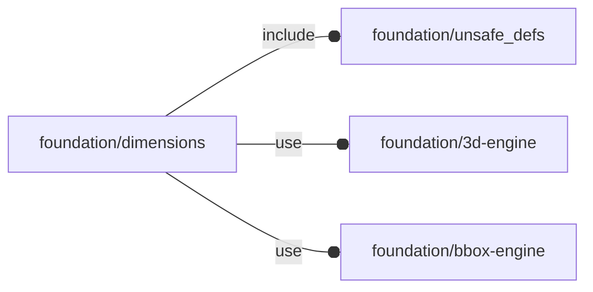

# package foundation/dimensions

## Dependencies



Dimension line library.

This file is part of the 'OpenSCAD Foundation Library' (OFL) project.

Copyright © 2021, Giampiero Gabbiani <giampiero@gabbiani.org>

SPDX-License-Identifier: [GPL-3.0-or-later](https://spdx.org/licenses/GPL-3.0-or-later.html)


## Variables

---

### variable FL_DIM_NS

__Default:__

    "dim"

prefix used for namespacing

## Functions

---

### function fl_Dimension

__Syntax:__

```text
fl_Dimension(value,label)
```

Constructor for single dimension lines.


__Parameters:__

__value__  
mandatory value

__label__  
mandatory label string


---

### function fl_DimensionPack

__Syntax:__

```text
fl_DimensionPack(dimension_list)
```

Constructor for a strip of dimension lines indexed by their labels. Each
element can be later retrieved by using the standard [fl_property()](core.md#function-fl_property) getter on
the strip itself, like in the following code:

    strip = fl_DimensionPack([
              fl_Dimension(20,"Height"),
              fl_Dimension(10,"Width")],
              ...
            );
    ...
    fl_dimension(fl_property(strip,"Height"),...);
    fl_dimension(fl_property(strip,"Width"),...);


---

### function fl_dim_label

__Syntax:__

```text
fl_dim_label(type,value)
```

helper dimension line label

---

### function fl_dim_value

__Syntax:__

```text
fl_dim_value(type,value)
```

helper dimension line value

## Modules

---

### module fl_dimension

__Syntax:__

    fl_dimension(verbs=FL_ADD,geometry,align,distr,gap,line_width,object,view,mode)

Children context:

| name        | description                                              |
| ----------  | -------------------------------------------------------- |
| $dim_align  | current alignment                                        |
| $dim_distr  | distribution direction, equal to the «distr» parameter   |
| $dim_gap    | gap between stacked dimension lines                      |
| $dim_label  | current dimension line label                             |
| $dim_level  | current dimension line stacking level (always positive)  |
| $dim_mode   | current mode                                             |
| $dim_object | bounded object                                           |
| $dim_spread | distribution direction in 2D space (always X or Y axis)  |
| $dim_value  | current value                                            |
| $dim_view   | dimension line bounded view                              |
| $dim_width  | current line width                                       |


__Parameters:__

__verbs__  
supported verbs: FL_ADD

__align__  
Position of the measure line with respect to its distribute direction:

| value                  | description                                   |
| ---------------------  | --------------------------------------------- |
| "centered"             | default value                                 |
| "positive"             | aligned in the positive half of the view plane|
| "negative"             | aligned in the negative half of the view plane|
| «scalar signed value»  | position of the start of the measurement line on the normal to its distribution direction |


__distr__  
Distribution direction of stacked dimension lines:

| value  | description         |
| -----  | ------------------- |
| "h+"   | horizontal positive |
| "h-"   | horizontal negative |
| "v+"   | vertical positive   |
| "v-"   | vertical negative   |


__gap__  
fixed gap between stacked dimension lines

__line_width__  
dimension line thickness

__object__  
The object to which the dimension line is attached.

__view__  
Name of the projection plane view:

| value    | projection plane  |
| -----    | ------------------|
| "right"  | XZ                |
| "top"    | XY                |
| "bottom" | YX                |
| "left"   | ZY                |
| "front"  | XZ                |
| "back"   | ZX                |


__mode__  
Dimension line mode:

| value    | projection plane                                                  |
| -----    | ----------------------------------------------------------------- |
| "silent" | no text is shown                                                  |
| "label"  | dimension label is shown                                          |
| "value"  | dimension value is shown                                          |
| "full"   | dimension will show a full text in the format label=value         |
|  undef   | value is inherited from $dim_mode if any, set to "full" otherwise |


