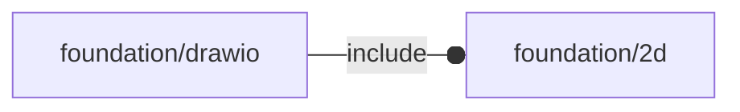

# package foundation/drawio

## Dependencies



## Functions

---

### function dio_polyCoords

__Syntax:__

```text
dio_polyCoords(points,size)
```

## Modules

---

### module dio_polyCoords

__Syntax:__

    dio_polyCoords(verbs=FL_ADD,points,size,quadrant)

