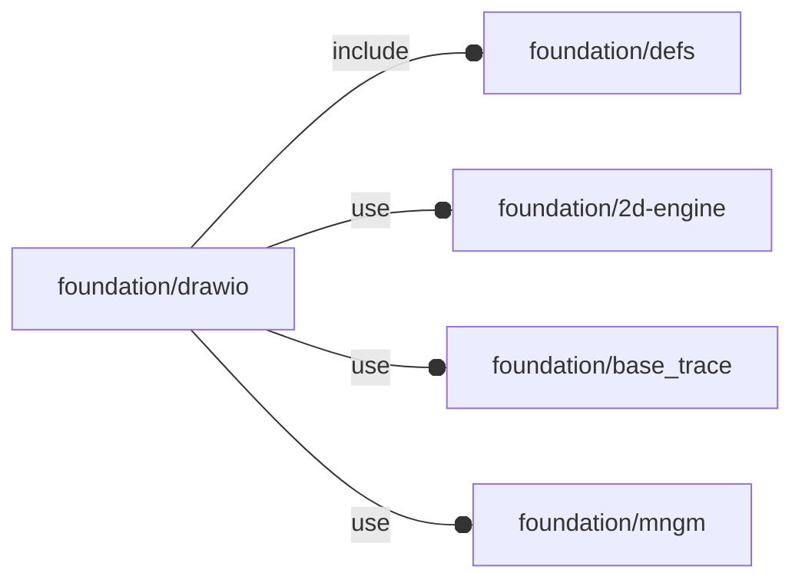

# package foundation/drawio

## Dependencies



Draw.io helpers.
This module is **DEPRECATED** and will be removed in a future.

Copyright © 2021, Giampiero Gabbiani (giampiero@gabbiani.org)

SPDX-License-Identifier: [GPL-3.0-or-later](https://spdx.org/licenses/GPL-3.0-or-later.html)


## Functions

---

### function dio_polyCoords

__Syntax:__

```text
dio_polyCoords(points,size)
```

Y invert and scale to size from draw.io coords.

Draw.io stores geometries in the domain [0..1], so the final size is just a
scale operation.

Expressing an actual size in the span [0..1] is just a matter of dividing
the actual size for the global X or Y length.


## Modules

---

### module dio_polyCoords

__Syntax:__

    dio_polyCoords(verbs=FL_ADD,points,size,quadrant)

__Parameters:__

__verbs__  
FL_ADD,FL_AXIS,FL_BBOX

__points__  
2d point list as provided by the Base Polygon Draw.io shape

__size__  
2d size

__quadrant__  
native positioning when undef


