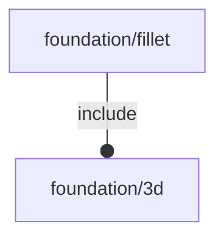

# package foundation/fillet

## System Context

## Functions

---

### function _3d_

__Syntax:__

    _3d_(p)

---

### function fl_bb_90DegFillet

__Syntax:__

    fl_bb_90DegFillet(r,n,child_bbox)

---

### function rad

__Syntax:__

    rad(x)

## Modules

---

### module fl_90DegFillet

__Syntax:__

    fl_90DegFillet(verbs=FL_ADD,r,n,child_bbox,direction,octant)

---

### module fl_fillet

__Syntax:__

    fl_fillet(verbs=FL_ADD,r,h,rx,ry,direction,octant)

---

### module fl_hFillet

__Syntax:__

    fl_hFillet(verbs=FL_ADD,r,h,rx,ry,direction,octant)

---

### module fl_vFillet

__Syntax:__

    fl_vFillet(verbs=FL_ADD,r,h,rx,ry,direction,octant)

