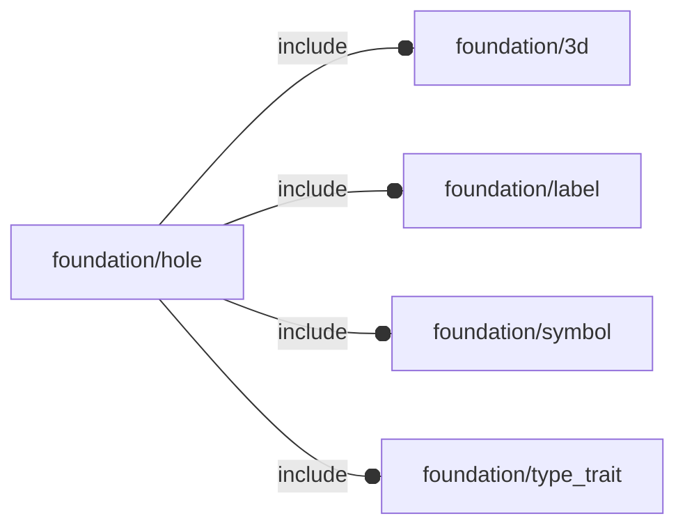

# package foundation/hole

## Dependencies



Hole engine implementation.


*Published under __GNU General Public License v3__*

## Functions

---

### function fl_Hole

__Syntax:__

```text
fl_Hole(position,d,normal=+Z,depth=0,ldir,loct,screw)
```

constructor

__Parameters:__

__position__  
3d hole position

__d__  
diameter

__normal__  
normal

__depth__  
when depth is null hole is pass-through

__ldir__  
OPTIONAL label direction in [direction,rotation] format

__loct__  
OPTIONAL label octant

__screw__  
OPTIONAL screw


---

### function fl_hole_d

__Syntax:__

```text
fl_hole_d(hole,value)
```

---

### function fl_hole_depth

__Syntax:__

```text
fl_hole_depth(hole,value)
```

---

### function fl_hole_ldir

__Syntax:__

```text
fl_hole_ldir(hole,value)
```

---

### function fl_hole_loct

__Syntax:__

```text
fl_hole_loct(hole,value)
```

---

### function fl_hole_n

__Syntax:__

```text
fl_hole_n(hole,value)
```

---

### function fl_hole_pos

__Syntax:__

```text
fl_hole_pos(hole,value)
```

---

### function fl_hole_screw

__Syntax:__

```text
fl_hole_screw(hole,value,default)
```

---

### function fl_holes

__Syntax:__

```text
fl_holes(type,value)
```

---

### function fl_tt_is3d

__Syntax:__

```text
fl_tt_is3d(3d)
```

---

### function fl_tt_isDirectionRotation

__Syntax:__

```text
fl_tt_isDirectionRotation(value)
```

---

### function fl_tt_isHole

__Syntax:__

```text
fl_tt_isHole(hole)
```

Hole representation as mandatory properties check:
- 3d   : hole position
- n    : applied surface normal
- d    : hole diameter
- depth: hole depth (0 means pass-thru hole)


---

### function fl_tt_isHoleList

__Syntax:__

```text
fl_tt_isHoleList(list)
```

---

### function fl_tt_isOctant

__Syntax:__

```text
fl_tt_isOctant(3d)
```

## Modules

---

### module fl_hole_Context

__Syntax:__

    fl_hole_Context(hole,thick,ordinal,screw)

prepare context for children() holes

- $hole_pos      : hole position
- $hole_d        : hole diameter
- $hole_depth    : hole depth (set to «thick» for pass-thru)
- $hole_direction: [$hole_n,0]
- $hole_i        : OPTIONAL hole number
- $hole_label    : OPTIONAL string label
- $hole_ldir     : [direction,rotation]
- $hole_loct     : label octant
- $hole_n        : hole normal
- $hole_screw    : OPTIONAL hole screw


__Parameters:__

__thick__  
fallback thickness

__ordinal__  
OPTIONAL hole number

__screw__  
fallback screw


---

### module fl_hole_debug

__Syntax:__

    fl_hole_debug(holes,enable=[-X,+X,-Y,+Y,-Z,+Z],thick=0,screw,debug)

Layouts of hole symbols

:memo: **NOTE:** supported normals are x,y or z semi-axis ONLY


__Parameters:__

__holes__  
list of holes specs

__enable__  
enabled normals in floating semi-axis list form

__thick__  
pass-through thickness

__screw__  
fallback screw

__debug__  
see constructor [fl_parm_Debug()](base_parameters.md#function-fl_parm_debug)


---

### module fl_holes

__Syntax:__

    fl_holes(holes,enable=[-X,+X,-Y,+Y,-Z,+Z],thick=0,screw)

Layouts holes according to their defined positions, depth and enabled normals.

:memo: **NOTE:** supported normals are x,y or z semi-axis ONLY


__Parameters:__

__holes__  
list of holes specs

__enable__  
enabled normals in floating semi-axis list form

__thick__  
pass-through thickness

__screw__  
fallback screw


---

### module fl_lay_holes

__Syntax:__

    fl_lay_holes(holes,enable=[-X,+X,-Y,+Y,-Z,+Z],thick=0,screw)

Layouts children along a list of holes.

See [fl_hole_Context{}](#module-fl_hole_context) for context variables passed to children().

:memo: **NOTE:** supported normals are x,y or z semi-axis ONLY


__Parameters:__

__holes__  
list of hole specs

__enable__  
enabled normals in floating semi-axis list form

__thick__  
pass-through thickness

__screw__  
fallback screw


