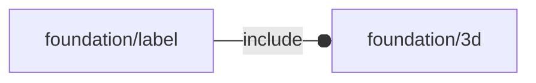

# package foundation/label

## Dependencies

## Functions

---

### function fl_repos

__Syntax:__

    fl_repos(oldpos,oldsize,newsize)

---

### function fl_resize

__Syntax:__

    fl_resize(oldsize,newsize,auto=false)

## Modules

---

### module fl_label

__Syntax:__

    fl_label(verbs=FL_ADD,string,fg="white",size,thick,extra=0,octant,direction)

