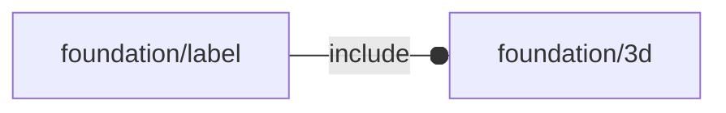

# package foundation/label

## Dependencies



*Published under __GNU General Public License v3__*

## Functions

---

### function fl_repos

__Syntax:__

```text
fl_repos(oldpos,oldsize,newsize)
```

modify position according to size modifications


---

### function fl_resize

__Syntax:__

```text
fl_resize(oldsize,newsize,auto=false)
```

mimics standard resize() module behaviour


## Modules

---

### module fl_label

__Syntax:__

    fl_label(verbs=FL_ADD,string,fg="white",size,thick,extra=0,octant,direction)

__Parameters:__

__verbs__  
supported verbs: FL_ADD, FL_AXES

__size__  
font y-size

__thick__  
depth along z-axis

__extra__  
extra delta to add to octant placement

__octant__  
when undef native positioning is used

__direction__  
desired direction [director,rotation] or native direction if undef


