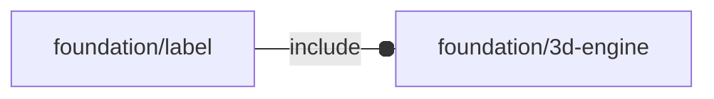

# package foundation/label

## Dependencies



Copyright © 2021, Giampiero Gabbiani (giampiero@gabbiani.org)

SPDX-License-Identifier: [GPL-3.0-or-later](https://spdx.org/licenses/GPL-3.0-or-later.html)


## Functions

---

### function fl_repos

__Syntax:__

```text
fl_repos(oldpos,oldsize,newsize)
```

modify position according to size modifications

TODO: likely to be removed


---

### function fl_resize

__Syntax:__

```text
fl_resize(oldsize,newsize,auto=false)
```

mimics standard resize() module behavior

TODO: either remove or move elsewhere


## Modules

---

### module fl_label

__Syntax:__

    fl_label(verbs=FL_ADD,string,fg="white",size,thick=0.1,extra=0,font="Symbola:style=Regular",octant,direction)

__Parameters:__

__verbs__  
supported verbs: FL_ADD, FL_AXES

__string__  
TODO: rename as «text»

__size__  
font y-size

__thick__  
depth along z-axis

__extra__  
extra delta to add to octant placement

__font__  
String. The name of the font that should be used.

__octant__  
when undef native positioning is used

__direction__  
desired direction [director,rotation] or native direction if undef


