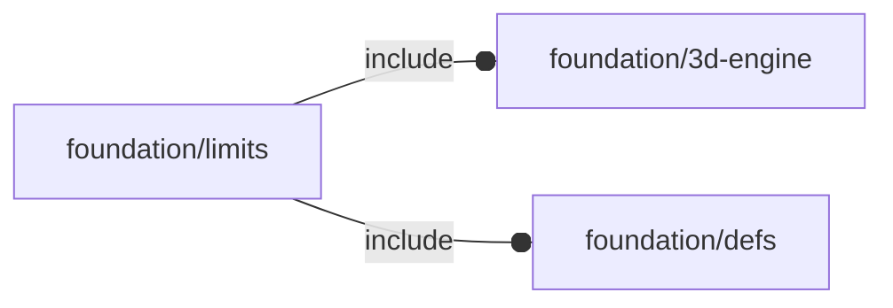
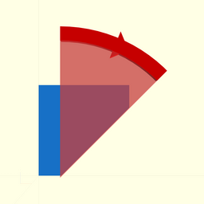
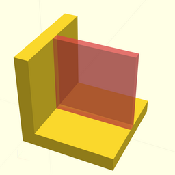
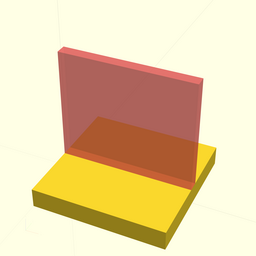

# package foundation/limits

## Dependencies



Recommended settings for 3d printing properties
(limits taken from [Knowledge base | Hubs](https://www.hubs.com/knowledge-base/))

This file is part of the 'OpenSCAD Foundation Library' (OFL) project.

Copyright © 2021, Giampiero Gabbiani (giampiero@gabbiani.org)

SPDX-License-Identifier: [GPL-3.0-or-later](https://spdx.org/licenses/GPL-3.0-or-later.html)


## Variables

---

### variable $fl_print_tech

__Default:__

    FL_TECH_FDM

this is the printing technology used

---

### variable FL_LIMIT_CLEARANCE

__Default:__

    "Connecting/moving parts"

The recommended clearance between two moving or connecting parts

---

### variable FL_LIMIT_DETAILS

__Default:__

    "Embossed & engraved details"

Features on the model that are raised or recessed below the model surface [mm,mm]

---

### variable FL_LIMIT_ESCAPE

__Default:__

    "Escape holes"

The minimum diameter of escape holes to allow for the removal of build material

---

### variable FL_LIMIT_FEATURES

__Default:__

    "Minimum features"

Recommended minimum size of a feature to ensure it will not fail to print

---

### variable FL_LIMIT_HBRIDGES

__Default:__

    "Horizontal Bridges"

The span a technology can print without the need for support

---

### variable FL_LIMIT_HOLES

__Default:__

    "Holes"

Minimum diameter a technology can successfully print a hole

---

### variable FL_LIMIT_OVERHANGS

__Default:__

    "Support & overhangs"



Maximum angle a wall can be printed at without requiring support (degree).


---

### variable FL_LIMIT_PIN

__Default:__

    "Pin diameter"

Minimum diameter a pin can be printed at

---

### variable FL_LIMIT_SWALLS

__Default:__

    "Supported walls"



The minimum width of walls connected to the rest of the print on at least
two sides (mm).


---

### variable FL_LIMIT_TOLERANCE

__Default:__

    "Tolerance"

Expected tolerance (diameter accuracy) of a specific technology [mm,%]

---

### variable FL_LIMIT_UWALLS

__Default:__

    "Unsupported walls"



Unsupported walls are connected to the rest of the print on less than two
sides (mm).


---

### variable FL_TECHNOLOGIES

__Default:__

    [FL_TECH_SLS,FL_TECH_FDM,FL_TECH_SLA,FL_TECH_MJ,FL_TECH_BJ,FL_TECH_DMLS,]

---

### variable FL_TECH_BJ

__Default:__

    "Binder jetting"

---

### variable FL_TECH_DMLS

__Default:__

    "Direct metal Laser sintering"

---

### variable FL_TECH_FDM

__Default:__

    "Fused deposition modeling"

---

### variable FL_TECH_MJ

__Default:__

    "Material jetting"

---

### variable FL_TECH_SLA

__Default:__

    "Stereo lithography"

---

### variable FL_TECH_SLS

__Default:__

    "Selective Laser sintering"

## Functions

---

### function fl_techLimit

__Syntax:__

```text
fl_techLimit(name)
```

returns the corresponding recommended value for the «property» name of the
current $fl_technology.


