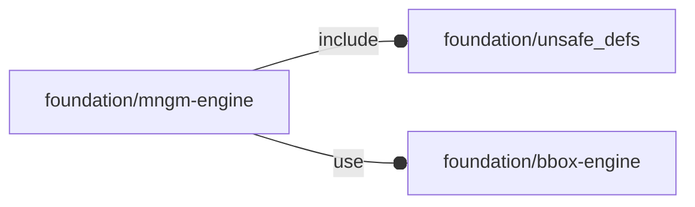

# package foundation/mngm-engine

## Dependencies

Verb management for OpenSCAD Foundation Library.

This file is part of the 'OpenSCAD Foundation Library' (OFL) project.

Copyright © 2021, Giampiero Gabbiani <giampiero@gabbiani.org>

SPDX-License-Identifier: [GPL-3.0-or-later](https://spdx.org/licenses/GPL-3.0-or-later.html)

## Modules

---

### module fl_generic_vloop

__Syntax:__

    fl_generic_vloop(verbs,bbox,M=I,D=I)

This module is the generic (i.e. valid for both two-dimensional and
three-dimensional spaces) low-level API implementing the main verb-driven
loop of each OFL API.

Formally this is divided in three steps:

1. verb looping
2. quadrant/octant translation (matrix «M»)
3. orientation along a given direction / angle (matrix «D»)

**1. Verb looping:**

Each verb passed in the verb list parameter triggers the children modules
with an execution context describing:

- the verb actually triggered (so the primitive to be implemented by children
  modules)
- the OpenSCAD character modifier (see [OpenSCAD User Manual/Modifier
  Characters](https://en.wikibooks.org/wiki/OpenSCAD_User_Manual/Modifier_Characters))

Passing a verb list like `[FL_ADD, FL_DRILL]` will loop children modules two
times, once for the FL_ADD implementation and once for the FL_DRILL.

The only exception to this is the FL_AXES verb, that needs to be executed
outside the children transformation pipeline (without applying matrix «M»).
FL_AXES implementation must be provided as child sub module with index equal
to 1.

So a verb list like `[FL_ADD, FL_AXES, FL_DRILL]` will trigger the
0-indexed child module twice: once for FL_ADD and once for FL_DRILL.

FL_AXES will be executed separately by this API triggering the 1-indexed
child module if the following conditions are met:

- FL_AXES is present in the verb list parameter
- the number of children sub module is >1.

**2. Quadrant/octant translation**

A coordinate system divides space in different zones,
four [quadrants](https://en.wikipedia.org/wiki/Quadrant_(plane_geometry)) for
two-dimensional spaces, eight
[octants](https://en.wikipedia.org/wiki/Octant_(solid_geometry)) for
three-dimensional ones.

Using the bounding-box information provided by the «bbox» parameter, we can
place the shapes defined by children modules exactly in one of these zones
passing to this primitive the corresponding translation matrix «M».

**3. Orientation**

OFL can also orient shapes defined by child modules along any axis in space
and additionally rotate around it. This operation - available only for
three-dimensional spaces - is performed through the matrix «D».

Context variables:

| Name       | Context   | Description
| ---------- | --------- | ---------------------
| $verb      | Children  | current parsed verb
| $modifier  | Children  | current verb modifier (one of "OFF", "ON", "DEBUG", "ONLY" or "TRANSPARENT")

__Parameters:__

__verbs__  
verb list

__bbox__  
mandatory bounding box

__M__  
translation matrix used for positioning

__D__  
transformation matrix used for orientation

---

### module fl_generic_vmanage

__Syntax:__

    fl_generic_vmanage(verbs,this,positioning,direction,m=function(positioning,type)I,d=function(direction)I)

This module is a high-level generic (i.e. valid for both two-dimensional and
three-dimensional spaces) version of [fl_generic_vloop{}](#module-fl_generic_vloop), it does pretty much
the same things but with an improved interface and an enriched children
context.

Context variables:

| Name             | Context   | Description                                         |
| ---------------- | --------- | --------------------------------------------------- |
| $this            | Children  | 3d object                                           |
| $this_verb       | Children  | currently processed verb                            |
| $this_size       | Children  | object 3d dimensions                                |
| $this_bbox       | Children  | bounding box corners in [low,high] format           |
| $this_direction  | Children  | orientation in [director,rotation] format           |
| $this_octant     | Children  | positioning octant (for three-dimensional objects)  |
| $this_quadrant   | Children  | positioning quadrant (for two-dimensional objects)  |
| $fl_clearance    | Children  | multi-verb parameter (see [fl_parm_clearance()](core.md#function-fl_parm_clearance))      |
| $fl_thickness    | Children  | multi-verb parameter (see [fl_parm_thickness()](core.md#function-fl_parm_thickness))      |
| $fl_tolerance    | Children  | multi-verb parameter (see fl_parm_tolerance())      |
|                  | Children  | see [fl_generic_vloop{}](#module-fl_generic_vloop) Children context             |

__Parameters:__

__positioning__  
when undef native positioning is used

__direction__  
desired direction [director,rotation], native direction when undef

__m__  
function literal providing the positioning matrix M

__d__  
function literal providing the orientation matrix D

