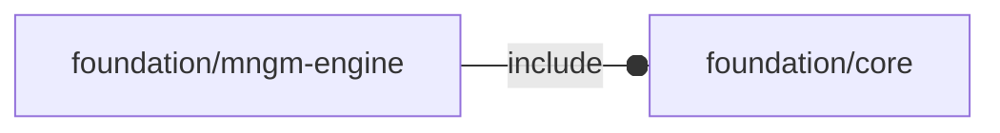

# package foundation/mngm-engine

## Dependencies

Verb management for OpenSCAD Foundation Library.

Copyright © 2021, Giampiero Gabbiani (giampiero@gabbiani.org)

SPDX-License-Identifier: [GPL-3.0-or-later](https://spdx.org/licenses/GPL-3.0-or-later.html)

## Modules

---

### module fl_manage

__Syntax:__

    fl_manage(verbs,M,D)

manage verbs parsing, placement and orientation

children context:

- $verb    : current parsed verb
- $modifier: current verb modifier

__Parameters:__

__verbs__  
verb list

__M__  
placement matrix

__D__  
orientation matrix

