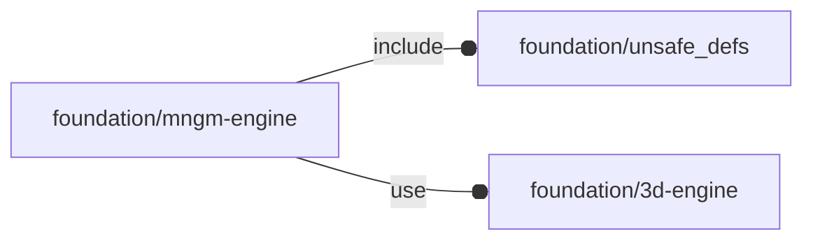

# package foundation/mngm-engine

## Dependencies

Verb management for OpenSCAD Foundation Library.

Copyright © 2021, Giampiero Gabbiani (giampiero@gabbiani.org)

SPDX-License-Identifier: [GPL-3.0-or-later](https://spdx.org/licenses/GPL-3.0-or-later.html)

## Modules

---

### module fl_vloop

__Syntax:__

    fl_vloop(verbs,bbox,octant,direction,quadrant,do_axes=true)

Low-level verb manager: parsing, placement and orientation for low level
APIs. Even if generally surpassed by the new polymorph{} module, this module
is still necessary when dealing with primitives without a «type» parameter.

This module is responsible for spatial basic transformations via «octant» and
«direction» parameters. It also intercepts and manages the FL_AXES verb that
will never arrive to children.

| Performed actions        | octant  | quadrant  | direction | verbs | bbox    |
| ---                      | ---     | ---       | ---       | ---   | ---     |
| octant translation       | X       | -         | -         | -     | X       |
| quadrant translation     | undef   | X         | -         | -     | X       |
| direction transformation | -       | -         | X         | -     | -       |
| FL_AXES                  | -       | -         | O         | X     | X       |

X: mandatory, O: optional, -: unused

Context variables:

| Name       | Context   | Description
| ---------- | --------- | ---------------------
| $verb      | Children  | current parsed verb
| $modifier  | Children  | current verb modifier

__Parameters:__

__verbs__  
verb list

__bbox__  
mandatory bounding box

__octant__  
when undef native positioning is used

__direction__  
desired direction [director,rotation], native direction when undef

