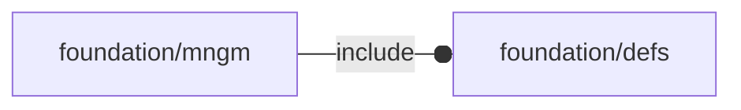

# package foundation/mngm

## Dependencies

Verb management for OpenSCAD Foundation Library.

Copyright © 2021, Giampiero Gabbiani (giampiero@gabbiani.org)

SPDX-License-Identifier: [GPL-3.0-or-later](https://spdx.org/licenses/GPL-3.0-or-later.html)

## Modules

---

### module fl_manage

__Syntax:__

    fl_manage(verbs,M,D,size,debug,connectors,holes,direction,ncs=[+FL_Z,+FL_X])

manage verbs parsing, placement, orientation and [fl_axes{}](defs.md#module-fl_axes)

children context:

- $verb    : current parsed verb
- $modifier: current verb modifier

__Parameters:__

__verbs__  
verb list

__M__  
placement matrix

__D__  
orientation matrix

__size__  
size used for [fl_axes{}](defs.md#module-fl_axes)

__debug__  
see constructor [fl_parm_Debug()](base_parameters.md#function-fl_parm_debug)

__connectors__  
list of connectors to debug

__holes__  
list of holes to debug

__direction__  
direction [director,rotation], when undef the debug flag will be ignored
for the direction symbol

__ncs__  
Native Coordinate System when different from the default [+Z,+X]

TODO: remove the [director,rotor] definition and use always the default

