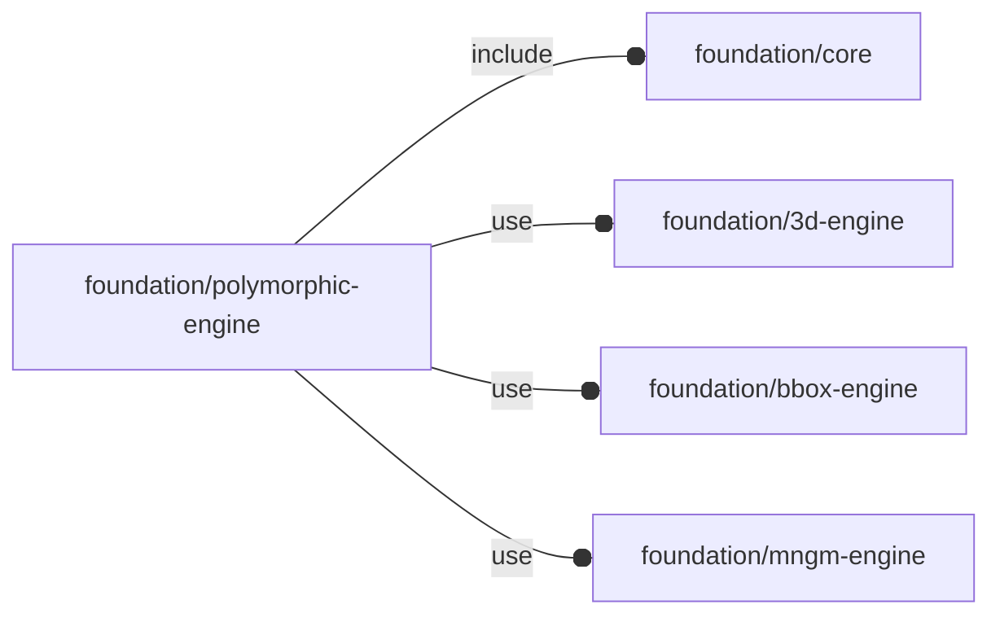

# package foundation/polymorphic-engine

## Dependencies

High-level management engine for OFL types.

This file is part of the 'OpenSCAD Foundation Library' (OFL) project.

Copyright © 2021, Giampiero Gabbiani <giampiero@gabbiani.org>

SPDX-License-Identifier: [GPL-3.0-or-later](https://spdx.org/licenses/GPL-3.0-or-later.html)

## Modules

---

### module fl_vmanage

__Syntax:__

    fl_vmanage(verbs=FL_ADD,this,octant,direction)

This module manages OFL types leveraging children implementation of the
actual engine while decoupling standard OFL parameters manipulation from
other engine specific ones.
Essentially it uses children module in place of not yet implemented module
literals, simplifying the new type module writing.

:memo: __NOTE:__ this module can be used only by OFL 'objects'.

    // An OFL object is a list of [key,values] items
    object = let(
      ...
    ) [
      fl_native(value=true),
      ...
    ];

A typical use of this high-level management module is the following:

    // this engine is called once for every verb passed to module fl_vmanage
    module engine() let(
      ...
    ) if ($this_verb==FL_ADD)
      ...;

      else if ($this_verb==FL_BBOX)
      ...;

      else if ($this_verb==FL_CUTOUT)
      ...;

      else if ($this_verb==FL_DRILL)
      ...;

      else if ($this_verb==FL_LAYOUT)
      ...;

      else if ($this_verb==FL_MOUNT)
      ...;

      else
        fl_error(["unimplemented verb",$this_verb]);

    fl_vmanage(verbs,object,octant=octant,direction=direction)
      engine(thick=T)
        // child passed to engine for further manipulation (ex. during FL_LAYOUT)
        fl_cylinder(h=10,r=screw_radius($iec_screw),octant=-Z);

Context variables:

| Name             | Context   | Description                                     |
| ---------------- | --------- | ----------------------------------------------- |
| $this            | Children  | 3d object                                       |
| $this_verb       | Children  | currently processed verb                        |
| $this_size       | Children  | object 3d dimensions                            |
| $this_bbox       | Children  | bounding box corners in [low,high] format       |
| $this_direction  | Children  | orientation in [director,rotation] format       |
| $this_octant     | Children  | positioning octant                              |
| $fl_thickness    | Children  | multi-verb parameter (see [fl_parm_thickness()](core.md#function-fl_parm_thickness))  |
| $fl_tolerance    | Children  | multi-verb parameter (see fl_parm_tolerance())  |

__Parameters:__

__verbs__  
supported verbs: FL_ADD, FL_ASSEMBLY, FL_BBOX, FL_DRILL, FL_FOOTPRINT, FL_LAYOUT

__octant__  
when undef native positioning is used

__direction__  
desired direction [director,rotation], native direction when undef

