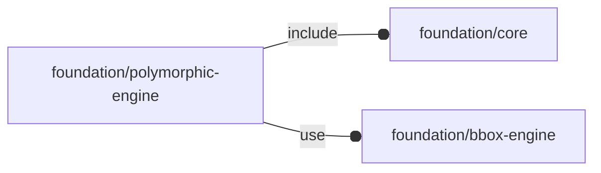

# package foundation/polymorphic-engine

## Dependencies

## Modules

---

### module fl_polymorph

__Syntax:__

    fl_polymorph(verbs=FL_ADD,this,debug,direction,octant)

This module manages OFL types leveraging children implementation of the
actual engine while decoupling standard OFL parameters manipulation from
other engine specific ones.
Essentially it uses children module in place of not yet implemented module
literals, simplifying the new type module writing.

:memo: __NOTE:__ this module can be used only by OFL 'objects'.

A typical use of this high-level management module is the following:

    // this engine is called once for every verb passed to module fl_polymorph
    module engine(thick) let(
      ...
    ) if ($this_verb==FL_ADD)
      ...;

      else if ($this_verb==FL_AXES)
        fl_doAxes($this_size,$this_direction);

      else if ($this_verb==FL_BBOX)
      ...;

      else if ($this_verb==FL_CUTOUT)
      ...;

      else if ($this_verb==FL_DRILL)
      ...;

      else if ($this_verb==FL_LAYOUT)
      ...;

      else if ($this_verb==FL_MOUNT)
      ...;

      else
        assert(false,str("***OFL ERROR***: unimplemented verb ",$this_verb));

    // this is the actual object definition as a list of [key,values] items
    object = let(
      ...
    ) [
      fl_native(value=true),
      ...
    ];

    fl_polymorph(verbs,object,direction=direction,octant=octant)
      engine(thick=T)
        // child passed to engine for further manipulation (ex. during FL_LAYOUT)
        fl_cylinder(h=10,r=screw_radius($iec_screw),octant=-Z);

Children context:

- $this            : 3d object
- $this_verb       : currently processed verb
- $this_size       : object 3d dimensions
- $this_bbox       : bounding box corners in [low,high] format
- $this_direction  : orientation in [director,rotation] format
- $this_octant     : positioning octant
- $this_debug      : debug parameters

__Parameters:__

__verbs__  
supported verbs: FL_ADD, FL_ASSEMBLY, FL_BBOX, FL_DRILL, FL_FOOTPRINT, FL_LAYOUT

__debug__  
see constructor [fl_parm_Debug()](core.md#function-fl_parm_debug)

__direction__  
desired direction [director,rotation], native direction when undef ([+X+Y+Z])

__octant__  
when undef native positioning is used

