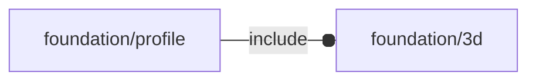

# package foundation/profile

## Dependencies

## Modules

---

### module fl_bentPlate

__Syntax:__

    fl_bentPlate(verbs=FL_ADD,type,radius,size,material,thick,direction,octant)

---

### module fl_profile

__Syntax:__

    fl_profile(verbs=FL_ADD,type,radius,size,material,thick,direction,octant)

