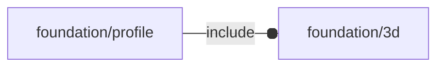

# package foundation/profile

## Dependencies

## Modules

---

### module fl_bentPlate

__Syntax:__

    fl_bentPlate(verbs=FL_ADD,type,radius,size,material,thick,direction,octant)

engine for generating bent plates.

__Parameters:__

__type__  
"L" or "U"

__radius__  
fold internal radius (square if undef)

__size__  
dimensioni del profilato [w,h,d]. Uno scalare s indica [s,s,s]

__material__  
actually a color

__thick__  
sheet thickness

__direction__  
desired direction [director,rotation], native direction when undef ([+X+Z])

__octant__  
when undef native positioning (see [variable FL_O](defs.md#variable-fl_o)) is used

---

### module fl_profile

__Syntax:__

    fl_profile(verbs=FL_ADD,type,radius,size,material,thick,direction,octant)

engine for generating profiles

