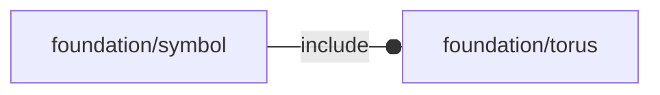

# package foundation/symbol

## Dependencies

## Modules

---

### module fl_sym_hole

__Syntax:__

    fl_sym_hole(verbs=FL_ADD)

this symbol uses as input a complete node context.

The symbol is oriented according to the hole normal.

__Parameters:__

__verbs__  
supported verbs: FL_ADD

---

### module fl_sym_plug

__Syntax:__

    fl_sym_plug(verbs=[FL_ADD,FL_AXES],type=undef,size=0.5)

---

### module fl_sym_socket

__Syntax:__

    fl_sym_socket(verbs=[FL_ADD,FL_AXES],type=undef,size=0.5)

---

### module fl_symbol

__Syntax:__

    fl_symbol(verbs=FL_ADD,type=undef,size=0.5,symbol)

provides the symbol required in its 'canonical' form:
- "plug": 'a piece that fits into a hole in order to close it'
         Its canonical form implies an orientation of the piece coherent
         with its insertion movement along +Z axis.
- "socket": 'a part of the body into which another part fits'
         Its canonical form implies an orientation of the piece coherent
         with its fitting movement along -Z axis.

[variable FL_LAYOUT](defs.md#variable-fl_layout) is used for proper label orientation

Children context:

- $sym_ldir: [axis,angle]
- $sym_size: size in 3d format

__Parameters:__

__verbs__  
supported verbs: FL_ADD, FL_LAYOUT

__size__  
default size given as a scalar

__symbol__  
currently "plug" or "socket"

