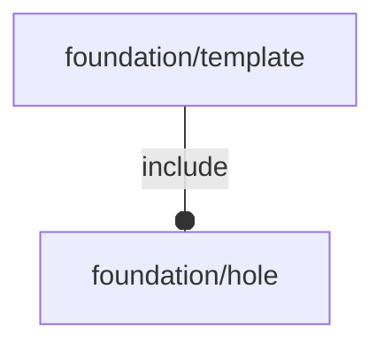

# package foundation/template

## System Context

## Functions

---

### function constructor

__Syntax:__

    constructor(description,bbox,holes)

## Modules

---

### module stub

__Syntax:__

    stub(verbs=FL_ADD,type,direction,octant)

