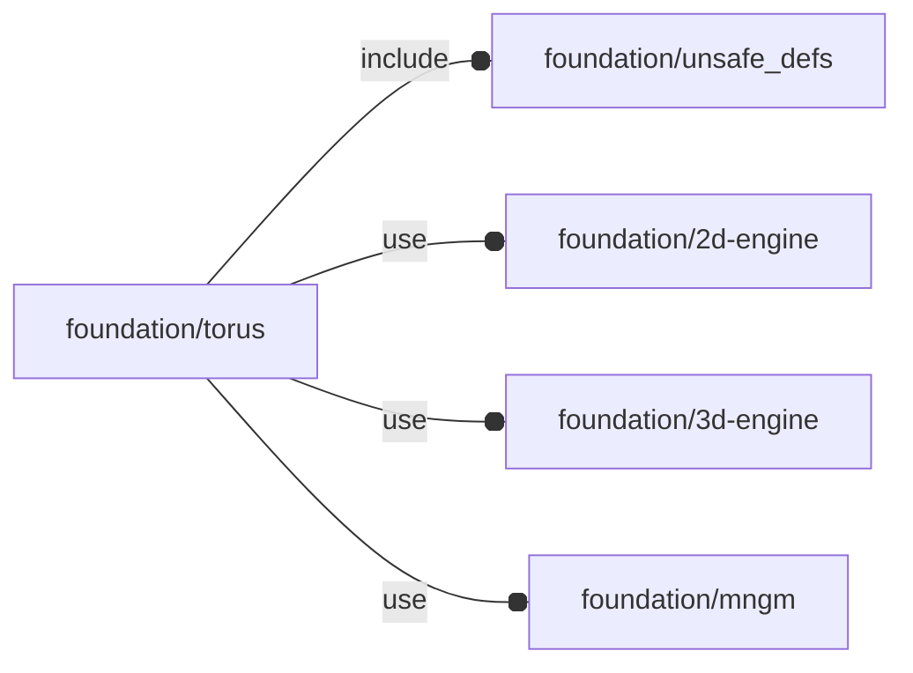

# package foundation/torus

## Dependencies



Copyright © 2021, Giampiero Gabbiani (giampiero@gabbiani.org)

SPDX-License-Identifier: [GPL-3.0-or-later](https://spdx.org/licenses/GPL-3.0-or-later.html)


## Functions

---

### function fl_bb_torus

__Syntax:__

```text
fl_bb_torus(r,d,e,R)
```

__Parameters:__

__r__  
radius of the circular tube.

__d__  
diameter of the circular tube.

__e__  
elliptic tube [a,b] form

__R__  
distance from the center of the tube to the center of the torus


## Modules

---

### module fl_torus

__Syntax:__

    fl_torus(verbs=FL_ADD,r,d,e,R,direction,octant)

«e» and «R» are mutually exclusive parameters


__Parameters:__

__verbs__  
supported verbs: FL_ADD, FL_AXES, FL_BBOX

__r__  
radius of the circular tube.

__d__  
diameter of the circular tube.

__e__  
elliptic tube [a,b] form

__R__  
distance from the center of the tube to the center of the torus

__direction__  
desired direction [director,rotation], native direction when undef ([+X+Y+Z])

__octant__  
when undef native positioning is used


