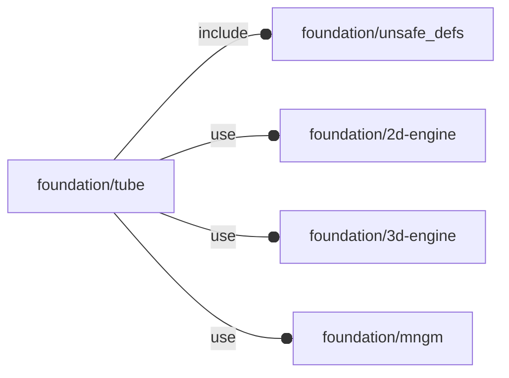

# package foundation/tube

## Dependencies

Copyright © 2021, Giampiero Gabbiani (giampiero@gabbiani.org)

SPDX-License-Identifier: [GPL-3.0-or-later](https://spdx.org/licenses/GPL-3.0-or-later.html)

## Modules

---

### module fl_tube

__Syntax:__

    fl_tube(verbs=FL_ADD,base,r,d,h,thick,direction,octant)

__Parameters:__

__verbs__  
supported verbs: FL_ADD, FL_ASSEMBLY, FL_BBOX, FL_DRILL, FL_FOOTPRINT, FL_LAYOUT

__base__  
base ellipse in [a,b] form

__r__  
«base» alternative radius for circular tubes

__d__  
«base» alternative diameter for circular tubes

__h__  
pipe height

__thick__  
tube thickness

__direction__  
desired direction [director,rotation], native direction when undef ([+X+Y+Z])

__octant__  
when undef native positioning is used

