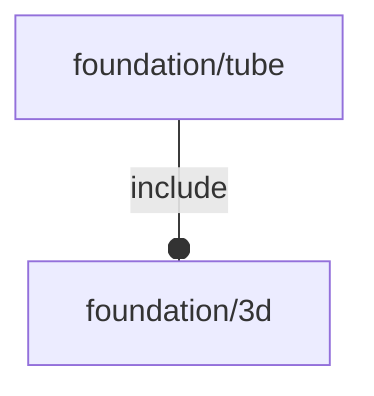

# package foundation/tube

## System Context

```mermaid
graph TD
    A1[foundation/tube] --o|include| A2[foundation/3d]
```

## Modules

---

### module fl_tube

__Syntax:__

    fl_tube(verbs=FL_ADD,base,r,d,h,thick,direction,octant)

