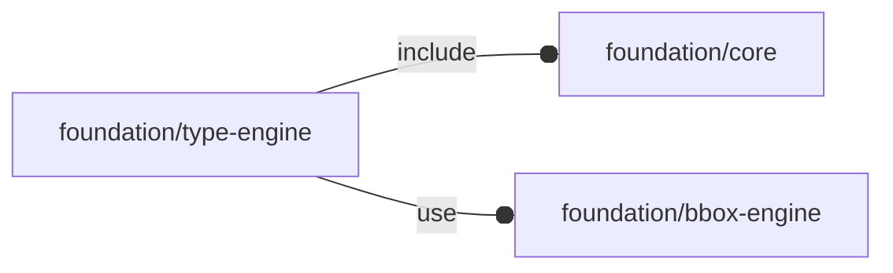

# package foundation/type-engine

## Dependencies



## Functions

---

### function fl_Object

__Syntax:__

```text
fl_Object(bbox,pload,name,description,engine,others=[])
```

Base constructor for OFL pseudo-objects.


__Parameters:__

__bbox__  
mandatory bounding-box

__pload__  
optional payload

__name__  
optional name

__description__  
optional description

__engine__  
optional engine

__others__  
optional other key/value list to be concatenated.


