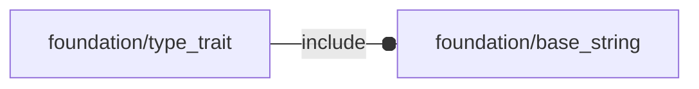

# package foundation/type_trait

## Dependencies



Type traits implementation file.

Copyright © 2021, Giampiero Gabbiani (giampiero@gabbiani.org)

SPDX-License-Identifier: [GPL-3.0-or-later](https://spdx.org/licenses/GPL-3.0-or-later.html)


## Functions

---

### function fl_tt_is2d

__Syntax:__

```text
fl_tt_is2d(p)
```

---

### function fl_tt_is3d

__Syntax:__

```text
fl_tt_is3d(p)
```

---

### function fl_tt_isAxis

__Syntax:__

```text
fl_tt_isAxis(axis)
```

---

### function fl_tt_isAxisKVList

__Syntax:__

```text
fl_tt_isAxisKVList(list)
```

Semi-axis Key/value list

Each item of the list is actually a key/value pair representing a value
associated to one semi-axis. The dimension of this representation is floating
from 0 (empty list) to 6 (complete list).

example:

```
thick=[["+x",3],["-Z",1.5]];
```

indicates a thickness of 3mm along +X and of 1.5mm along +Z.


---

### function fl_tt_isAxisList

__Syntax:__

```text
fl_tt_isAxisList(list)
```

Floating semi-axis list.

One row with matrix representation of cartesian semi-axes in whatever order.

example:

```
[-X,+Z,-Y]
```


---

### function fl_tt_isAxisString

__Syntax:__

```text
fl_tt_isAxisString(s)
```

---

### function fl_tt_isAxisVList

__Syntax:__

```text
fl_tt_isAxisVList(list)
```

Full semi axis value list.

Each row represents values associated to X,Y and Z semi-axes.

```
[
 [«-x value»,«+x value»],
 [«-y value»,«+y value»],
 [«-z value»,«+z value»]
]
```

example:

```
[
 [0,3],
 [0,0],
 [1.5,0]
]
```

indicates a value of 3 along +X, 1.5 along -Z and 0 otherwise.


---

### function fl_tt_isBoundingBox

__Syntax:__

```text
fl_tt_isBoundingBox(bbox)
```

return true when «bbox» is a bounding box in [low,high] format.

A 3D bounding box (or 3D "bbox") is a volume of space that encloses a
three-dimensional object. The 3D bounding box is defined as a rectangular
parallelepiped, composed of six faces, each of which is a quadrilateral.
The 3D bounding box is usually defined by three dimensions: width, height
and depth. These three dimensions define the dimensions of the rectangular
parallelepiped.

The [low,high] format is a list containing two 3d points:

```
low-point==min(x),min(y),min(z) of the bounding box
high-point==max(x),max(y),max(z) of the bounding box
```

__NOTE__: 0-sized bounding box are allowed

TODO: When using a 3D bounding box, the coordinates of the 3D object are
often converted to coordinates local to the bounding box, making
manipulation of the object even easier.


__Parameters:__

__bbox__  
bounding box to be verified


---

### function fl_tt_isColor

__Syntax:__

```text
fl_tt_isColor(color)
```

---

### function fl_tt_isCompSpecList

__Syntax:__

```text
fl_tt_isCompSpecList(specs)
```

Component specification list check

   ["label", component]


---

### function fl_tt_isComponent

__Syntax:__

```text
fl_tt_isComponent(comp)
```

check if «comp» is a valid component format:

   ["engine", [position], [[director],rotation], type, properties]


---

### function fl_tt_isDirectionRotation

__Syntax:__

```text
fl_tt_isDirectionRotation(value)
```

check whether «value» is a valid [axis,rotation angle] format:


---

### function fl_tt_isInDictionary

__Syntax:__

```text
fl_tt_isInDictionary(string,dictionary,nocase=true)
```

true if «string» appears in «dictionary»


---

### function fl_tt_isKV

__Syntax:__

```text
fl_tt_isKV(kv,dictionary=[],f=function(value)value!=undef)
```

true if «kv» is a key/value pair satisfying f(value)


---

### function fl_tt_isKVList

__Syntax:__

```text
fl_tt_isKVList(list,dictionary=[],f=function(value)value!=undef,size)
```

true if «kv» is a key/value pair list with each item satisfying f(value)


---

### function fl_tt_isList

__Syntax:__

```text
fl_tt_isList(list,f=function(value)true,size)
```

return true when «list» is a list and each item satisfy f(value)


__Parameters:__

__list__  
list to be verified

__f__  
check function

__size__  
optional list size


---

### function fl_tt_isOctant

__Syntax:__

```text
fl_tt_isOctant(3d)
```

---

### function fl_tt_isPointNormal

__Syntax:__

```text
fl_tt_isPointNormal(plane)
```

plane in point-normal format: [<3d point>,<plane normal>]


---

### function fl_tt_isPointNormalList

__Syntax:__

```text
fl_tt_isPointNormalList(list)
```

---

### function fl_tt_isPosition

__Syntax:__

```text
fl_tt_isPosition(p)
```

---

### function fl_tt_isVerbList

__Syntax:__

```text
fl_tt_isVerbList(verbs)
```

verb list is either a single verb string or a list of verb strings.


