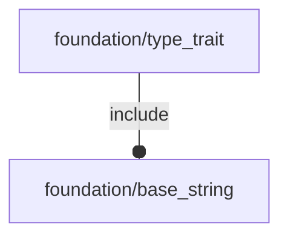

# package foundation/type_trait

## System Context

## Functions

---

### function fl_tt_isAxis

__Syntax:__

    fl_tt_isAxis(axis)

---

### function fl_tt_isAxisKVList

__Syntax:__

    fl_tt_isAxisKVList(list)

---

### function fl_tt_isAxisList

__Syntax:__

    fl_tt_isAxisList(list)

---

### function fl_tt_isAxisString

__Syntax:__

    fl_tt_isAxisString(s)

---

### function fl_tt_isAxisVList

__Syntax:__

    fl_tt_isAxisVList(list)

---

### function fl_tt_isInDictionary

__Syntax:__

    fl_tt_isInDictionary(string,dictionary,nocase=true)

---

### function fl_tt_isKV

__Syntax:__

    fl_tt_isKV(kv,dictionary=[],f=function(value)value!=undef)

---

### function fl_tt_isKVList

__Syntax:__

    fl_tt_isKVList(list,dictionary=[],f=function(value)value!=undef,size)

---

### function fl_tt_isList

__Syntax:__

    fl_tt_isList(list,f=function(value)true,size)

---

### function fl_tt_isPointNormal

__Syntax:__

    fl_tt_isPointNormal(plane)

---

### function fl_tt_isPointNormalList

__Syntax:__

    fl_tt_isPointNormalList(list)

