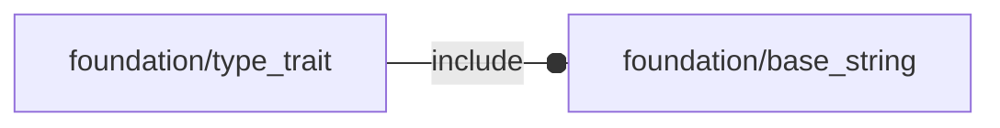

# package foundation/type_trait

## Dependencies



Type traits implementation file.


*Published under __GNU General Public License v3__*

## Functions

---

### function fl_tt_isAxis

__Syntax:__

```text
fl_tt_isAxis(axis)
```

---

### function fl_tt_isAxisKVList

__Syntax:__

```text
fl_tt_isAxisKVList(list)
```

Semi-axis Key/value list

Each item of the list is actually a key/value pair representing a value
associated to one semi-axis. The dimension of this representation is floating
from 0 (empty list) to 6 (complete list).

example:

```
thick=[["+x",3],["-Z",1.5]];
```

indicates a thickness of 3mm along +X and of 1.5mm along +Z.


---

### function fl_tt_isAxisList

__Syntax:__

```text
fl_tt_isAxisList(list)
```

Floating semi-axis list.

One row with matricial representation of cartesian semi-axes in whatever order.

example:

```
[-X,+Z,-Y]
```


---

### function fl_tt_isAxisString

__Syntax:__

```text
fl_tt_isAxisString(s)
```

---

### function fl_tt_isAxisVList

__Syntax:__

```text
fl_tt_isAxisVList(list)
```

Full semi axis value list.

Each row represents values associated to X,Y and Z semi-axes.

```
[
 [«-x value»,«+x value»],
 [«-y value»,«+y value»],
 [«-z value»,«+z value»]
]
```

example:

```
[
 [0,3],
 [0,0],
 [1.5,0]
]
```

indicates a value of 3 along +X, 1.5 along -Z and 0 otherwise.


---

### function fl_tt_isInDictionary

__Syntax:__

```text
fl_tt_isInDictionary(string,dictionary,nocase=true)
```

true if «string» appears in «dictionary»


---

### function fl_tt_isKV

__Syntax:__

```text
fl_tt_isKV(kv,dictionary=[],f=function(value)value!=undef)
```

true if «kv» is a key/value pair satisfying f(value)


---

### function fl_tt_isKVList

__Syntax:__

```text
fl_tt_isKVList(list,dictionary=[],f=function(value)value!=undef,size)
```

true if «kv» is a key/value pair list with each item satisfying f(value)


---

### function fl_tt_isList

__Syntax:__

```text
fl_tt_isList(list,f=function(value)true,size)
```

return true when «list» is a list and each item satisfy f(value)


__Parameters:__

__list__  
list to be verified

__f__  
check function

__size__  
optional list size


---

### function fl_tt_isPointNormal

__Syntax:__

```text
fl_tt_isPointNormal(plane)
```

plane in point-normal format: [<3d point>,<plane normal>]


---

### function fl_tt_isPointNormalList

__Syntax:__

```text
fl_tt_isPointNormalList(list)
```

