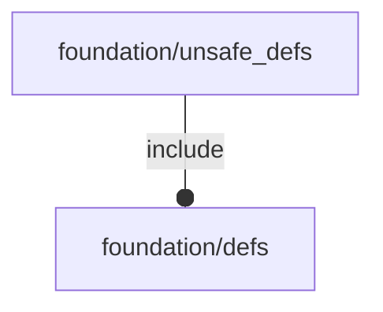

# package foundation/unsafe_defs

## System Context

## Variables

---

### variable I

__Default:__

    FL_I

---

### variable NIL

__Default:__

    FL_NIL

---

### variable NIL2

__Default:__

    FL_NIL2

---

### variable O

__Default:__

    FL_O

---

### variable X

__Default:__

    FL_X

---

### variable Y

__Default:__

    FL_Y

---

### variable Z

__Default:__

    FL_Z

## Functions

---

### function R

__Syntax:__

    R(u,theta)

---

### function Rx

__Syntax:__

    Rx(alpha)

---

### function Rxyz

__Syntax:__

    Rxyz(alpha)

---

### function Ry

__Syntax:__

    Ry(alpha)

---

### function Rz

__Syntax:__

    Rz(alpha)

---

### function S

__Syntax:__

    S(s)

---

### function T

__Syntax:__

    T(t)

---

### function X

__Syntax:__

    X(x)

---

### function Y

__Syntax:__

    Y(y)

---

### function Z

__Syntax:__

    Z(z)

