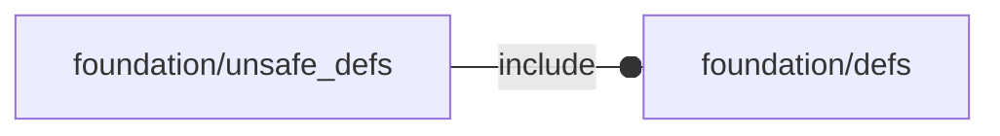

# package foundation/unsafe_defs

## Dependencies



## Variables

---

### variable I

__Default:__

    FL_I

---

### variable NIL

__Default:__

    FL_NIL

---

### variable NIL2

__Default:__

    FL_NIL2

---

### variable O

__Default:__

    FL_O

---

### variable X

__Default:__

    FL_X

---

### variable Y

__Default:__

    FL_Y

---

### variable Z

__Default:__

    FL_Z

## Functions

---

### function R

__Syntax:__

```text
R(u,theta)
```

---

### function Rx

__Syntax:__

```text
Rx(alpha)
```

---

### function Rxyz

__Syntax:__

```text
Rxyz(alpha)
```

---

### function Ry

__Syntax:__

```text
Ry(alpha)
```

---

### function Rz

__Syntax:__

```text
Rz(alpha)
```

---

### function S

__Syntax:__

```text
S(s)
```

---

### function T

__Syntax:__

```text
T(t)
```

---

### function X

__Syntax:__

```text
X(x)
```

---

### function Y

__Syntax:__

```text
Y(y)
```

---

### function Z

__Syntax:__

```text
Z(z)
```

