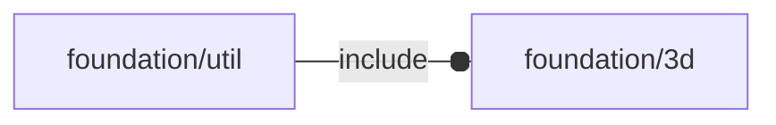

# package foundation/util

## Dependencies

## Functions

---

### function fl_bend_faceSet

__Syntax:__

    fl_bend_faceSet(type,value)

---

### function fl_bend_sheet

__Syntax:__

    fl_bend_sheet(type,value)

---

### function fl_folding

__Syntax:__

    fl_folding(faces,material="silver")

## Modules

---

### module fl_bend

__Syntax:__

    fl_bend(verbs=FL_ADD,type,flat=false,direction,octant)

---

### module fl_cutout

__Syntax:__

    fl_cutout(len,z=Z,x=X,trim=[0,0,0],cut=false,debug=false,delta=0)

---

### module fl_rail

__Syntax:__

    fl_rail(length)

