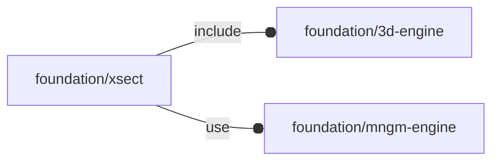

# package foundation/xsect

## Dependencies

## Modules

---

### module fl_xsect

__Syntax:__

    fl_xsect(verbs=FL_ADD,plane,bbox,enable=true,debug)

__Parameters:__

__verbs__  
FL_ADD,FL_AXES,FL_BBOX

__plane__  
cutting plane in point-normal format: [<3d point>,<plane normal>]

See also [fl_tt_isPointNormal()](type_trait.md#function-fl_tt_ispointnormal).

**NOTE**: «plane normal» is oriented according to the visualization direction

__debug__  
see constructor [fl_parm_Debug()](core.md#function-fl_parm_debug)

