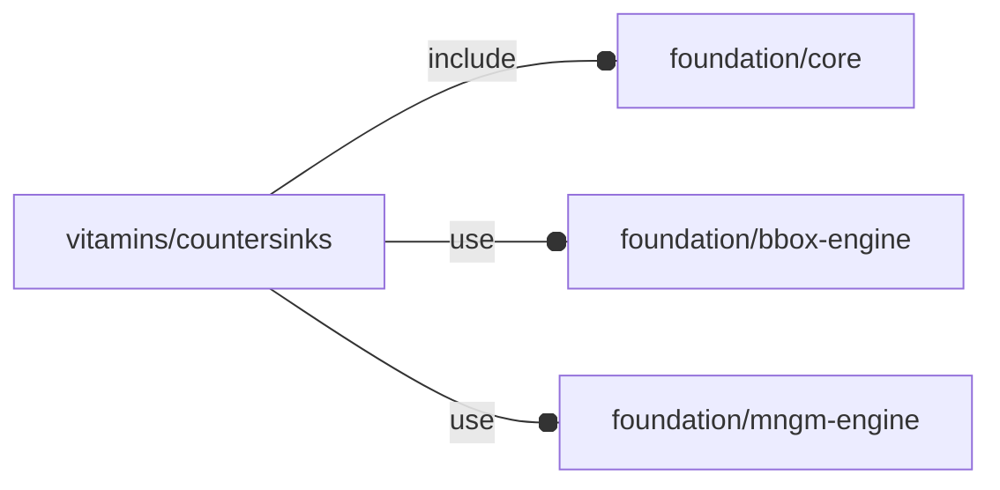

# package vitamins/countersinks

## Dependencies



Countersink definitions based on UNI 5933 and ISO 10642

Copyright © 2021, Giampiero Gabbiani (giampiero@gabbiani.org)

SPDX-License-Identifier: [GPL-3.0-or-later](https://spdx.org/licenses/GPL-3.0-or-later.html)


## Variables

---

### variable FL_CS_ISO_DICT

__Default:__

    [FL_CS_ISO_M2,FL_CS_ISO_M2p5,FL_CS_ISO_M3,FL_CS_ISO_M4,FL_CS_ISO_M5,FL_CS_ISO_M6,FL_CS_ISO_M8,FL_CS_ISO_M10,FL_CS_ISO_M12,FL_CS_ISO_M14,FL_CS_ISO_M16,FL_CS_ISO_M20]

---

### variable FL_CS_ISO_M10

__Default:__

    fl_Countersink("Countersink ISO 10642 M10",10,20.69,6.200)

---

### variable FL_CS_ISO_M12

__Default:__

    fl_Countersink("Countersink ISO 10642 M12",12,24.81,7.440)

---

### variable FL_CS_ISO_M14

__Default:__

    fl_Countersink("Countersink ISO 10642 M14",14,28.31,8.400)

---

### variable FL_CS_ISO_M16

__Default:__

    fl_Countersink("Countersink ISO 10642 M16",16,30.61,8.800)

---

### variable FL_CS_ISO_M2

__Default:__

    fl_Countersink("Countersink ISO 10642 M2",2,4.09,1.350)

---

### variable FL_CS_ISO_M20

__Default:__

    fl_Countersink("Countersink ISO 10642 M20",20,36.75,10.160)

---

### variable FL_CS_ISO_M2p5

__Default:__

    fl_Countersink("Countersink ISO 10642 M2.5",2.5,5.08,1.690)

---

### variable FL_CS_ISO_M3

__Default:__

    fl_Countersink("Countersink ISO 10642 M3",3,5.81,1.860)

---

### variable FL_CS_ISO_M4

__Default:__

    fl_Countersink("Countersink ISO 10642 M4",4,7.96,2.480)

---

### variable FL_CS_ISO_M5

__Default:__

    fl_Countersink("Countersink ISO 10642 M5",5,10.07,3.100)

---

### variable FL_CS_ISO_M6

__Default:__

    fl_Countersink("Countersink ISO 10642 M6",6,12.16,3.720)

---

### variable FL_CS_ISO_M8

__Default:__

    fl_Countersink("Countersink ISO 10642 M8",8,16.43,4.960)

---

### variable FL_CS_NS

__Default:__

    "cs"

countersinks namespace

---

### variable FL_CS_UNI_DICT

__Default:__

    [FL_CS_UNI_M3,FL_CS_UNI_M4,FL_CS_UNI_M5,FL_CS_UNI_M6,FL_CS_UNI_M8,FL_CS_UNI_M10,FL_CS_UNI_M12,FL_CS_UNI_M16,FL_CS_UNI_M20]

---

### variable FL_CS_UNI_M10

__Default:__

    fl_Countersink("Countersink UNI 5933 M10",10,20,5.5)

---

### variable FL_CS_UNI_M12

__Default:__

    fl_Countersink("Countersink UNI 5933 M12",12,24,6.5)

---

### variable FL_CS_UNI_M16

__Default:__

    fl_Countersink("Countersink UNI 5933 M16",16,30,7.5)

---

### variable FL_CS_UNI_M20

__Default:__

    fl_Countersink("Countersink UNI 5933 M20",20,36,8.5)

---

### variable FL_CS_UNI_M3

__Default:__

    fl_Countersink("Countersink UNI 5933 M3",3,6,1.7)

---

### variable FL_CS_UNI_M4

__Default:__

    fl_Countersink("Countersink UNI 5933 M4",4,8,2.3)

---

### variable FL_CS_UNI_M5

__Default:__

    fl_Countersink("Countersink UNI 5933 M5",5,10,2.8)

---

### variable FL_CS_UNI_M6

__Default:__

    fl_Countersink("Countersink UNI 5933 M6",6,12,3.3)

---

### variable FL_CS_UNI_M8

__Default:__

    fl_Countersink("Countersink UNI 5933 M8",8,16,4.4)

## Functions

---

### function fl_Countersink

__Syntax:__

```text
fl_Countersink(name,nominal,dk,k,alpha=90)
```

__Parameters:__

__nominal__  
nominal ⌀

__dk__  
countersink head ⌀

__k__  
head height

__alpha__  
countersink angle


---

### function fl_cs_angle

__Syntax:__

```text
fl_cs_angle(type,value)
```

---

### function fl_cs_dk

__Syntax:__

```text
fl_cs_dk(type,value)
```

---

### function fl_cs_h

__Syntax:__

```text
fl_cs_h(type)
```

---

### function fl_cs_k

__Syntax:__

```text
fl_cs_k(type,value)
```

---

### function fl_cs_select

__Syntax:__

```text
fl_cs_select(dictionary=FL_CS_ISO_DICT,name,nominal)
```

return a countersink list fitting the passed properties or undef if no match
no match found.


__Parameters:__

__name__  
countersink name, when undef all names are matched

__nominal__  
nominal , when undef all nominal are matched


## Modules

---

### module fl_countersink

__Syntax:__

    fl_countersink(verbs=FL_ADD,type,direction,octant)

Context variables:

| Name           | Context   | Description |
| -------------  | --------- | ---         |
| $fl_thickness  | Parameter | thickness of the surface to be FL_DRILLed. Can be verb-dependant (see [fl_parm_thickness()](../foundation/core.md#function-fl_parm_thickness)). |
| $fl_tolerance  | Parameter | tolerance added to countersink's dimensions during FL_ADD, FL_BBOX and FL_FOOTPRINT. Can be verb-dependant (see [fl_parm_tolerance()](../foundation/core.md#function-fl_parm_tolerance)). |


__Parameters:__

__verbs__  
supported verbs: FL_ADD, FL_AXES, FL_BBOX, FL_DRILL, FL_FOOTPRINT.

__direction__  
desired direction [director,rotation], native direction when undef

__octant__  
when undef native positioning is used (+Z)


