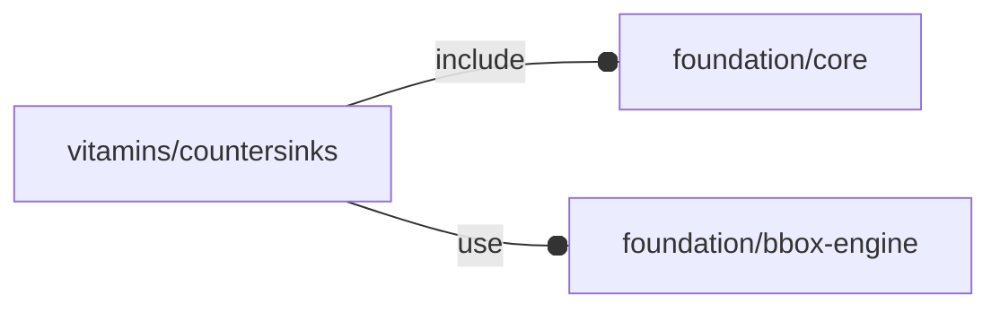

# package vitamins/countersinks

## Dependencies



Countersink definitions, data taken from:
https://www.sailornautica.it/viti-metallo-inox-aisi-316-e-304/927-vite-testa-svasata-piana-esagono-incassato-m3-uni-5933-acciaio-inox-aisi-316.html

Copyright © 2021, Giampiero Gabbiani (giampiero@gabbiani.org)

SPDX-License-Identifier: [GPL-3.0-or-later](https://spdx.org/licenses/GPL-3.0-or-later.html)


## Variables

---

### variable FL_CS_DICT

__Default:__

    [FL_CS_M3,FL_CS_M4,FL_CS_M5,FL_CS_M6,FL_CS_M8,FL_CS_M10,FL_CS_M12,FL_CS_M16,FL_CS_M20]

---

### variable FL_CS_M10

__Default:__

    fl_Countersink("FL_CS_M10",10,20,5.5)

---

### variable FL_CS_M12

__Default:__

    fl_Countersink("FL_CS_M12",12,24,6.5)

---

### variable FL_CS_M16

__Default:__

    fl_Countersink("FL_CS_M16",16,30,7.5)

---

### variable FL_CS_M20

__Default:__

    fl_Countersink("FL_CS_M20",20,36,8.5)

---

### variable FL_CS_M3

__Default:__

    fl_Countersink("FL_CS_M3",3,6,1.7)

---

### variable FL_CS_M4

__Default:__

    fl_Countersink("FL_CS_M4",4,8,2.3)

---

### variable FL_CS_M5

__Default:__

    fl_Countersink("FL_CS_M5",5,10,2.8)

---

### variable FL_CS_M6

__Default:__

    fl_Countersink("FL_CS_M6",6,12,3.3)

---

### variable FL_CS_M8

__Default:__

    fl_Countersink("FL_CS_M8",8,16,4.4)

---

### variable FL_CS_NS

__Default:__

    "cs"

countersinks namespace

## Functions

---

### function fl_Countersink

__Syntax:__

```text
fl_Countersink(name,nominal,dk,k,alpha=90)
```

__Parameters:__

__nominal__  
nominal ⌀

__dk__  
countersink head ⌀

__k__  
head height

__alpha__  
countersink angle


---

### function fl_cs_angle

__Syntax:__

```text
fl_cs_angle(type,value)
```

---

### function fl_cs_dk

__Syntax:__

```text
fl_cs_dk(type,value)
```

---

### function fl_cs_h

__Syntax:__

```text
fl_cs_h(type)
```

---

### function fl_cs_k

__Syntax:__

```text
fl_cs_k(type,value)
```

---

### function fl_cs_nominal

__Syntax:__

```text
fl_cs_nominal(type,value)
```

---

### function fl_cs_search

__Syntax:__

```text
fl_cs_search(name,d)
```

return a countersink list fitting the passed properties or undef if no match
no match found.


__Parameters:__

__d__  
nominal diameter


## Modules

---

### module fl_countersink

__Syntax:__

    fl_countersink(verbs=FL_ADD,type,tolerance=0,direction,octant)

__Parameters:__

__tolerance__  
tolerance added to countersink's dimensions

__direction__  
desired direction [director,rotation], native direction when undef

__octant__  
when undef native positioning is used (+Z)


