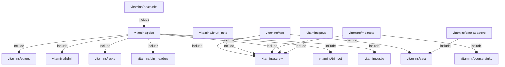

# Dependencies

```mermaid
graph TD
    A1[vitamins/hds] --o|include| A2[vitamins/sata]
    A1 --o|include| A3[vitamins/screw]
    A4[vitamins/heatsinks] --o|include| A5[vitamins/pcbs]
    A6[vitamins/knurl_nuts] --o|include| A3
    A7[vitamins/magnets] --o|include| A8[vitamins/countersinks]
    A7 --o|include| A3
    A5 --o|include| A9[vitamins/ethers]
    A5 --o|include| A10[vitamins/hdmi]
    A5 --o|include| A11[vitamins/jacks]
    A5 --o|include| A12[vitamins/pin_headers]
    A5 --o|include| A3
    A5 --o|include| A13[vitamins/trimpot]
    A5 --o|include| A14[vitamins/usbs]
    A15[vitamins/psus] --o|include| A3
    A16[vitamins/sata-adapters] --o|include| A2
```

