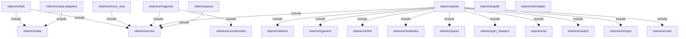

# Dependencies

```mermaid
graph TD
    A1[vitamins/countersinks]
    A2[vitamins/ethers]
    A3[vitamins/generic]
    A4[vitamins/hdmi]
    A5[vitamins/hds] --o|include| A6[vitamins/sata]
    A5 --o|include| A7[vitamins/screw]
    A8[vitamins/heatsinks]
    A9[vitamins/jacks]
    A10[vitamins/knurl_nuts] --o|include| A7
    A11[vitamins/magnets] --o|include| A1
    A11 --o|include| A7
    A12[vitamins/pcbs] --o|include| A2
    A12 --o|include| A3
    A12 --o|include| A4
    A12 --o|include| A8
    A12 --o|include| A9
    A12 --o|include| A13[vitamins/pin_headers]
    A12 --o|include| A7
    A12 --o|include| A14[vitamins/sd]
    A12 --o|include| A15[vitamins/switch]
    A12 --o|include| A16[vitamins/trimpot]
    A12 --o|include| A17[vitamins/usbs]
    A13
    A18[vitamins/psus] --o|include| A7
    A6
    A19[vitamins/sata-adapters] --o|include| A6
    A7
    A14
    A20[vitamins/spdts]
    A15
    A21[vitamins/template]
    A16
    A17
```

