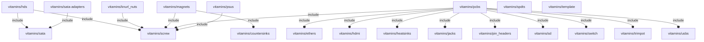

# Dependencies

```mermaid
graph TD
    A1[vitamins/countersinks]
    A2[vitamins/ethers]
    A3[vitamins/hdmi]
    A4[vitamins/hds] --o|include| A5[vitamins/sata]
    A4 --o|include| A6[vitamins/screw]
    A7[vitamins/heatsinks]
    A8[vitamins/jacks]
    A9[vitamins/knurl_nuts] --o|include| A6
    A10[vitamins/magnets] --o|include| A1
    A10 --o|include| A6
    A11[vitamins/pcbs] --o|include| A2
    A11 --o|include| A3
    A11 --o|include| A7
    A11 --o|include| A8
    A11 --o|include| A12[vitamins/pin_headers]
    A11 --o|include| A6
    A11 --o|include| A13[vitamins/sd]
    A11 --o|include| A14[vitamins/switch]
    A11 --o|include| A15[vitamins/trimpot]
    A11 --o|include| A16[vitamins/usbs]
    A12
    A17[vitamins/psus] --o|include| A6
    A5
    A18[vitamins/sata-adapters] --o|include| A5
    A6
    A13
    A19[vitamins/spdts]
    A14
    A20[vitamins/template]
    A15
    A16
```

