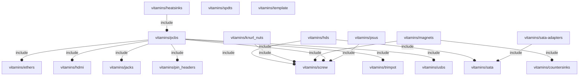

# Dependencies

```mermaid
graph TD
    A1[vitamins/countersinks]
    A2[vitamins/ethers]
    A3[vitamins/hdmi]
    A4[vitamins/hds] --o|include| A5[vitamins/sata]
    A4 --o|include| A6[vitamins/screw]
    A7[vitamins/heatsinks] --o|include| A8[vitamins/pcbs]
    A9[vitamins/jacks]
    A10[vitamins/knurl_nuts] --o|include| A6
    A11[vitamins/magnets] --o|include| A1
    A11 --o|include| A6
    A8 --o|include| A2
    A8 --o|include| A3
    A8 --o|include| A9
    A8 --o|include| A12[vitamins/pin_headers]
    A8 --o|include| A6
    A8 --o|include| A13[vitamins/trimpot]
    A8 --o|include| A14[vitamins/usbs]
    A12
    A15[vitamins/psus] --o|include| A6
    A5
    A16[vitamins/sata-adapters] --o|include| A5
    A6
    A17[vitamins/spdts]
    A18[vitamins/template]
    A13
    A14
```

