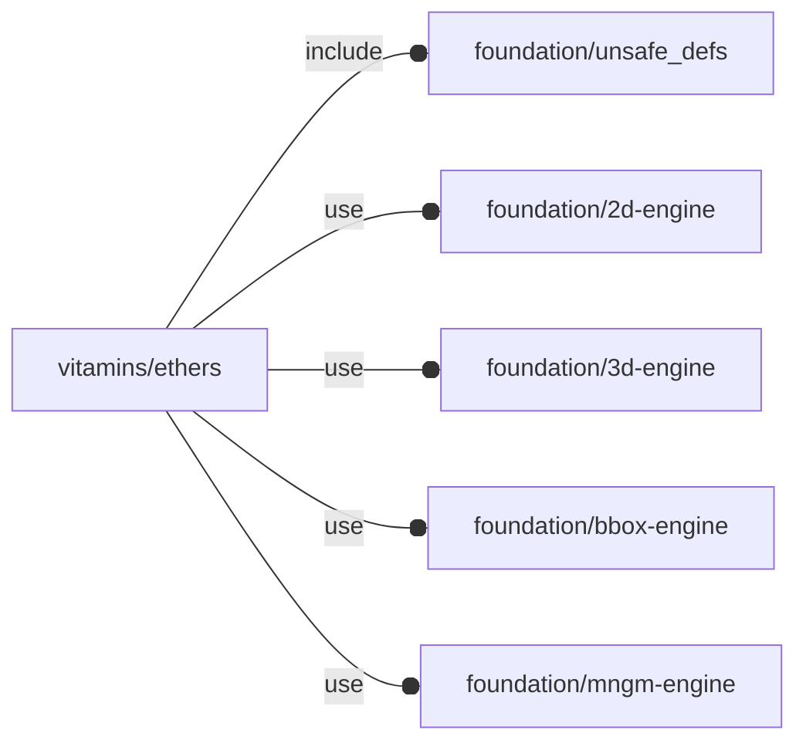

# package vitamins/ethers

## Dependencies



Ethernet.

Copyright © 2021, Giampiero Gabbiani (giampiero@gabbiani.org)

SPDX-License-Identifier: [GPL-3.0-or-later](https://spdx.org/licenses/GPL-3.0-or-later.html)


## Variables

---

### variable FL_ETHER_DICT

__Default:__

    [FL_ETHER_RJ45,FL_ETHER_RJ45_SM]

---

### variable FL_ETHER_FRAME_T

__Default:__

    1.5

part of a surface mount ethernet socket length is reserved for the external frame

---

### variable FL_ETHER_NS

__Default:__

    "ether"

ethernet namespace

---

### variable FL_ETHER_PLUG_L

__Default:__

    8.5

value of the internally inserted part of an RJ45 plug

---

### variable FL_ETHER_RJ45

__Default:__

    let(l=21,w=16,h=13.5)[fl_name(value="RJ45"),fl_bb_corners(value=[[-l/2,-w/2,0],[+l/2,+w/2,h]]),fl_cutout(value=[+FL_X]),fl_engine(value=str(FL_ETHER_NS,"/NopSCADlib")),]

---

### variable FL_ETHER_RJ45_SM

__Default:__

    let(l=12.6,w=17.4,h=11.5)[fl_name(value="RJ45 SLIM"),fl_bb_corners(value=[[-l+FL_ETHER_FRAME_T,-w/2,-FL_ETHER_Z_OFFSET],+[FL_ETHER_FRAME_T,w/2,h-FL_ETHER_Z_OFFSET]]),fl_cutout(value=[+FL_X]),fl_dxf(value="vitamins/ether-slim.dxf"),fl_engine(value=str(FL_ETHER_NS,"/native")),]

---

### variable FL_ETHER_Z_OFFSET

__Default:__

    5

a surface mount ethernet socket is partially embedded on PCB

## Functions

---

### function fl_ether_Zoffset

__Syntax:__

```text
fl_ether_Zoffset(type,value)
```

## Modules

---

### module fl_ether

__Syntax:__

    fl_ether(verbs=FL_ADD,type,cut_thick,cut_tolerance=0,cut_drift=0,debug,direction,octant,debug)

__Parameters:__

__verbs__  
supported verbs: FL_ADD,FL_AXES,FL_BBOX,FL_CUTOUT

__cut_thick__  
thickness for FL_CUTOUT

__cut_tolerance__  
tolerance used during FL_CUTOUT

__cut_drift__  
translation applied to cutout (default 0)

__debug__  
see constructor [fl_parm_Debug()](../foundation/core.md#function-fl_parm_debug)

__direction__  
desired direction [director,rotation], native direction when undef ([+X+Y+Z])

__octant__  
when undef native positioning is used


