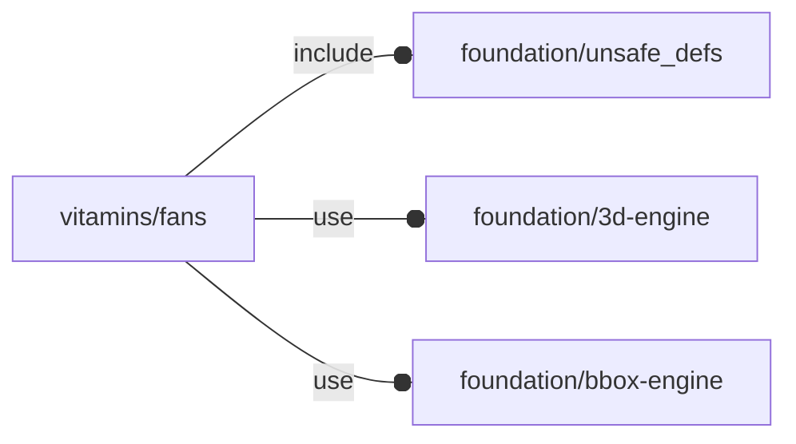

# package vitamins/fans

## Dependencies



NopSCADlib fan wrapper library. This library wraps NopSCADlib fan instances
into the OFL APIs.

This file is part of the 'OpenSCAD Foundation Library' (OFL) project.

Copyright © 2021, Giampiero Gabbiani <giampiero@gabbiani.org>

SPDX-License-Identifier: [GPL-3.0-or-later](https://spdx.org/licenses/GPL-3.0-or-later.html)


## Variables

---

### variable FL_FAN_120x25

__Default:__

    fl_Fan(fan120x25)

---

### variable FL_FAN_17x8

__Default:__

    fl_Fan(fan17x8)

---

### variable FL_FAN_25x10

__Default:__

    fl_Fan(fan25x10)

---

### variable FL_FAN_30x10

__Default:__

    fl_Fan(fan30x10)

---

### variable FL_FAN_40x11

__Default:__

    fl_Fan(fan40x11)

---

### variable FL_FAN_50x15

__Default:__

    fl_Fan(fan50x15)

---

### variable FL_FAN_60x15

__Default:__

    fl_Fan(fan60x15)

---

### variable FL_FAN_60x25

__Default:__

    fl_Fan(fan60x25)

---

### variable FL_FAN_70x15

__Default:__

    fl_Fan(fan70x15)

---

### variable FL_FAN_80x25

__Default:__

    fl_Fan(fan80x25)

---

### variable FL_FAN_80x38

__Default:__

    fl_Fan(fan80x38)

---

### variable FL_FAN_INVENTORY

__Default:__

    [FL_FAN_17x8,FL_FAN_25x10,FL_FAN_30x10,FL_FAN_40x11,FL_FAN_50x15,FL_FAN_60x15,FL_FAN_60x25,FL_FAN_70x15,FL_FAN_80x25,FL_FAN_80x38,FL_FAN_120x25,]

package inventory as a list of pre-defined and ready-to-use 'objects'

---

### variable FL_FAN_NAMES

__Default:__

    [for(fan=FL_FAN_INVENTORY)fl_name(fan)]

inventory item names

---

### variable FL_FAN_NS

__Default:__

    "fan"

prefix used for namespacing

## Functions

---

### function fl_Fan

__Syntax:__

```text
fl_Fan(nop,description)
```

Wraps a nop fan inside the corresponding OFL instance. The [fl_nominal()](../foundation/core.md#function-fl_nominal) is
equal to its diameter.


__Parameters:__

__description__  
optional description


---

### function fl_fan_screw

__Syntax:__

```text
fl_fan_screw(type)
```

Unwraps the nop screw from the OFL fan instance.

__NOTE__: the returned value is a **NopSCADlib** list.


## Modules

---

### module fl_fan

__Syntax:__

    fl_fan(verbs=FL_ADD,this,thick=0,octant,direction)

OFL fan module.

Children context during FL_LAYOUT:

- $fan_director: direction axis
- $fan_direction: direction in [$fan_director,0] form
- $fan_thick: non negative scalar expressing the current child invocation thickness
- $fan_verb: current child invocation verb


__Parameters:__

__verbs__  
supported verbs: FL_ADD, FL_ASSEMBLY, FL_BBOX, FL_DRILL, FL_FOOTPRINT, FL_LAYOUT

__thick__  
List of Z-axis thickness or a scalar value for FL_DRILL and FL_MOUNT
operations.

A positive value represents thickness along +Z semi-axis.
A negative value represents thickness along -Z semi-axis.
One scalar value will used for both Z semi-axes.

Example 1:

    thick = [+3,-1]

is interpreted as thickness of 3mm along +Z and 1mm along -Z

Example 2:

    thick = [-1]

is interpreted as thickness of 1mm along -Z 0mm along +Z

Example:

    thick = 2

is interpreted as a thickness of 2mm along ±Z


__octant__  
when undef native positioning is used

__direction__  
desired direction [director,rotation], native direction [+Z,0] when undef


