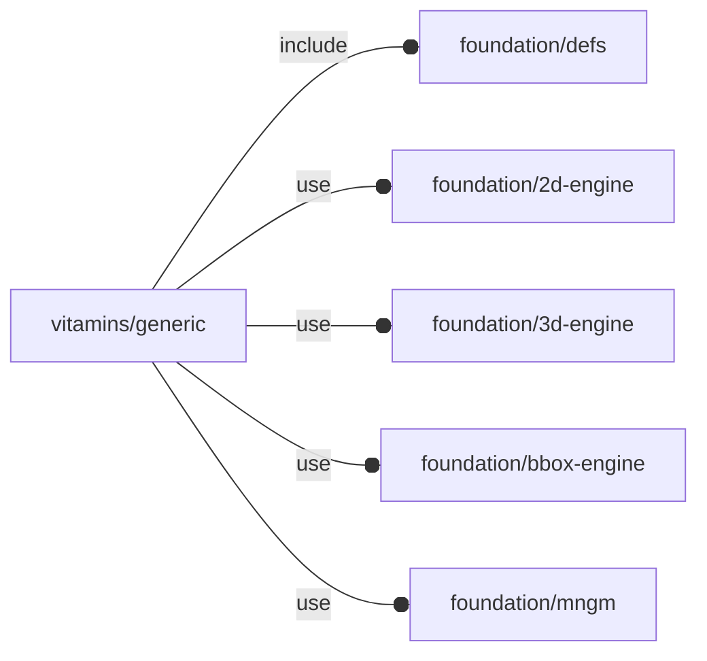

# package vitamins/generic

## Dependencies



## Variables

---

### variable FL_GENERIC_NS

__Default:__

    "GENERIC"

## Functions

---

### function fl_generic_Vitamin

__Syntax:__

```text
fl_generic_Vitamin(name,bbox,ghost=true,cut_directions)
```

## Modules

---

### module fl_generic_vitamin

__Syntax:__

    fl_generic_vitamin(verbs=FL_ADD,type,cut_thick=0,cut_tolerance=0,cut_drift=0,debug,octant,direction)

