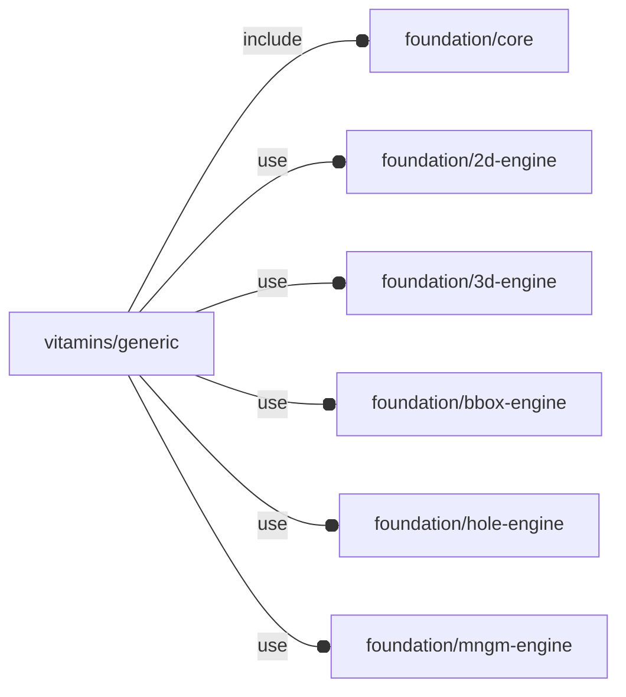

# package vitamins/generic

## Dependencies



## Variables

---

### variable FL_GENERIC_NS

__Default:__

    "GENERIC"

## Functions

---

### function fl_generic_Vitamin

__Syntax:__

```text
fl_generic_Vitamin(bbox,name,holes,ghost=true,cut_directions,engine="Generic",specs=[])
```

Generic vitamin constructor


__Parameters:__

__bbox__  
bounding box

__name__  
optional name, a default is created if 'undef'

__holes__  
optional hole list.

:memo: **NOTE:** the hole list will drive FL_DRILL operations.


__ghost__  
when true FL_ADD is a no-op.

__cut_directions__  
cut directions in floating semi-axis list format.

See also [fl_tt_isAxisList()](../foundation/traits-engine.md#function-fl_tt_isaxislist) and [fl_3d_AxisList()](../foundation/3d-engine.md#function-fl_3d_axislist)


---

### function fl_generic_ghost

__Syntax:__

```text
fl_generic_ghost(type,value)
```

## Modules

---

### module fl_generic_vitamin

__Syntax:__

    fl_generic_vitamin(verbs=FL_ADD,this,cut_drift=0,octant,direction)

Generic vitamin engine, usable when a cut out, drill or layout operation is
needed for a component not yet available as vitamin.

Context variables:

| Name           | Type      | Description |
| -------------- | --------- | ----------- |
| $hole_*        | Children  | the whole hole context is passed during FL_LAYOUT (see also fl_hole_Context()). |
| $fl_tolerance  | Parameter | used during FL_CUTOUT |
| $fl_thickness  | Parameter | Scalar or full semi axis value list for FL_CUTOUT, FL_DRILL and FL_LAYOUT thickness (see [fl_tt_isAxisVList()](../foundation/traits-engine.md#function-fl_tt_isaxisvlist)). This parameter represents the surface thickness along semi-axes to be drilled and/or cut out.  |


__Parameters:__

__verbs__  
supported verbs: FL_ADD,FL_AXES,FL_BBOX,FL_CUTOUT,FL_DRILL

__cut_drift__  
Scalar or full semi axis value list for translation applied to cutout
(see  [fl_tt_isAxisVList()](../foundation/traits-engine.md#function-fl_tt_isaxisvlist))


__octant__  
when undef native positioning is used

__direction__  
desired direction [director,rotation], native direction when undef


