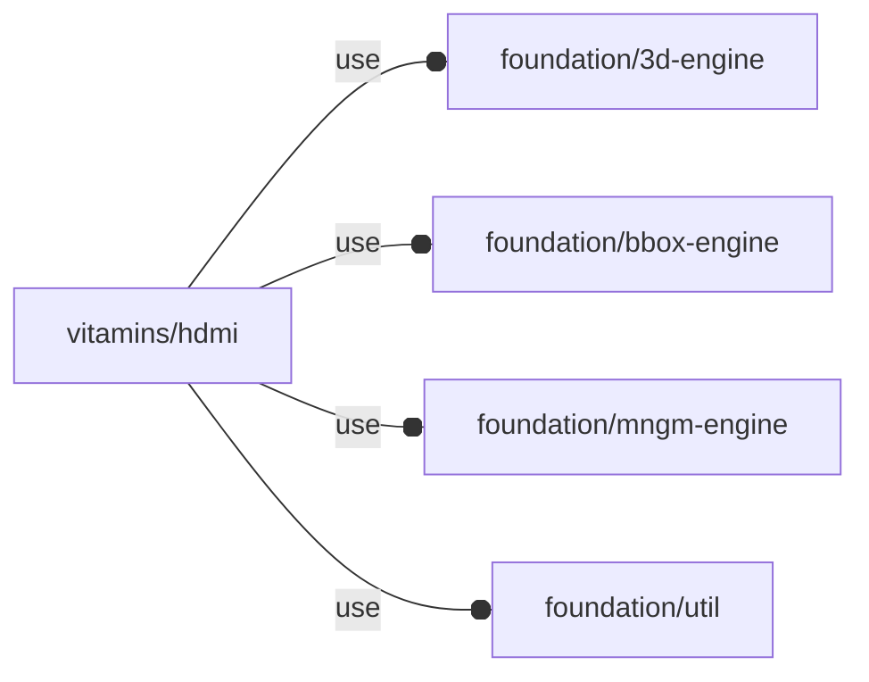

# package vitamins/hdmi

## Dependencies



NopSCADlib HDMI engine wrapper.

Copyright © 2021, Giampiero Gabbiani (giampiero@gabbiani.org)

SPDX-License-Identifier: [GPL-3.0-or-later](https://spdx.org/licenses/GPL-3.0-or-later.html)


## Variables

---

### variable FL_HDMI_DICT

__Default:__

    [FL_HDMI_TYPE_A,FL_HDMI_TYPE_C,FL_HDMI_TYPE_D]

---

### variable FL_HDMI_NS

__Default:__

    "hdmi"

---

### variable FL_HDMI_TYPE_A

__Default:__

    fl_hdmi_new(["hdmi_full","HDMI socket",12,14,10,3,4.5,6.5,0.5])

---

### variable FL_HDMI_TYPE_C

__Default:__

    fl_hdmi_new(["hdmi_mini","Mini HDMI socket",7.5,10.5,8.3,1.28,2.5,3.2,0.35])

---

### variable FL_HDMI_TYPE_D

__Default:__

    fl_hdmi_new(["hdmi_micro","Micro HDMI socket",8.5,5.9,4.43,1.4,2.3,3,0.3])

## Functions

---

### function fl_hdmi_nameKV

__Syntax:__

```text
fl_hdmi_nameKV(value)
```

---

### function fl_hdmi_new

__Syntax:__

```text
fl_hdmi_new(nop_type)
```

## Modules

---

### module fl_hdmi

__Syntax:__

    fl_hdmi(verbs=FL_ADD,type,cut_drift=0,octant,direction)

Context variables:

| Name | Type  | Description |
| ---  | ---   | ---         |
| $fl_thickness  | Parameter | thickness for FL_CUTOUT (see [variable FL_CUTOUT](../foundation/core.md#variable-fl_cutout))          |
| $fl_tolerance  | Parameter | tolerance used during FL_CUTOUT (see [variable FL_CUTOUT](../foundation/core.md#variable-fl_cutout))  |


__Parameters:__

__verbs__  
supported verbs: FL_ADD,FL_AXES,FL_BBOX,FL_CUTOUT

__cut_drift__  
translation applied to cutout

__octant__  
when undef native positioning is used

__direction__  
desired direction [director,rotation], native direction when undef ([+X+Y+Z])


